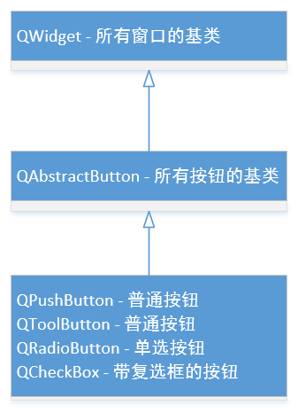
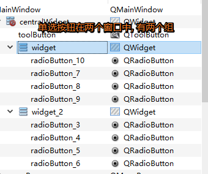
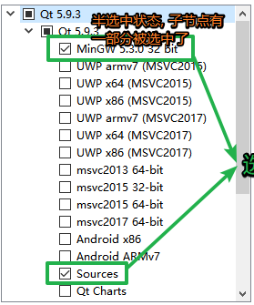

# 1 QAbstractButton



> QAbstractButton类是所有按钮的基类, 常用 的很多的api都是从这个基类继承的.

## 1.1 常用公共成员和槽函数

```c++
// 参数text的内容显示到按钮上
void QAbstractButton::setText(const QString &text);
// 得到按钮上显示的文本内容, 函数的返回就是
QString QAbstractButton::text() const;

// 得到按钮设置的图标
QIcon icon() const;
// 给按钮设置图标
void setIcon(const QIcon &icon);

// 得到按钮图标大小
QSize iconSize() const
// 设置按钮图标的大小
[slot]void setIconSize(const QSize &size);

// 判断按钮是否设置了checkable属性, 如果设置了点击按钮, 按钮一直处于选中状态
// 默认这个属性是关闭的, not checkable
bool isCheckable() const;
// 设置按钮的checkable属性
// 参数为true: 点击按钮, 按钮被选中, 松开鼠标, 按钮不弹起
// 参数为false: 点击按钮, 按钮被选中, 松开鼠标, 按钮弹起
void setCheckable(bool);

    
// 判断按钮是不是被按下的选中状态
bool isChecked() const;
// 设置按钮的选中状态: true-选中, false-没选中
void setChecked(bool);

```


## 1.2 常用信号

```c++
/*
当按钮被激活时(即，当鼠标光标在按钮内时按下然后释放)，当键入快捷键时，或者当click()或animateClick()被调用时，这个信号被发出。值得注意的是，如果调用setDown()、setChecked()或toggle()，则不会触发此信号。
*/
[signal] void QAbstractButton::clicked(bool checked = false);
// 在按下按钮的时候发射这个信号
[signal] void QAbstractButton::pressed();
// 在释放这个按钮的时候发射直观信号
[signal] void QAbstractButton::released();
// 每当可检查按钮改变其状态时，就会发出此信号。checked在选中按钮时为true，在未选中按钮时为false。
[signal] void QAbstractButton::toggled(bool checked);
```


# 2. QPushButton

> 这个类是一个常用按钮类, 操作这个按钮使用的大部分函数都是从父类继承过来的, 它的父类是`QAbstractButton`

## 2.1 常用API

```c++
// 构造函数
/*
参数:
	- icon: 按钮上显示的图标
	- text: 按钮上显示的标题
	- parent: 按钮的父对象, 可以不指定
*/
QPushButton::QPushButton(const QIcon &icon, const QString &text, QWidget *parent = nullptr);
QPushButton::QPushButton(const QString &text, QWidget *parent = nullptr);
QPushButton::QPushButton(QWidget *parent = nullptr);

// 判断按钮是不是默认按钮
bool isDefault() const;
// 一般在对话框窗口中使用, 将按钮设置为默认按钮, 自动关联 Enter 键 
void setDefault(bool);

/*
将弹出菜单菜单与此按钮关联起来。这将把按钮变成一个菜单按钮，在某些样式中会在按钮文本的右边产生一个小三角形。
*/
void QPushButton::setMenu(QMenu *menu);

/*
显示(弹出)相关的弹出菜单。如果没有这样的菜单，这个函数什么也不做。这个函数直到弹出菜单被用户关闭后才返回。
*/
[slot] void QPushButton::showMenu();
```


# 3. QToolButton

> 这个类也是一个常用按钮类, 使用方法和功能跟`QPushButton`基本一致, 只不过在和菜单进行管理这个方面, `QToolButton`类可以设置弹出的菜单的属性, 以及在显示图标的时候可以设置更多的样式, 可以理解为是一个增强版的`QPushButton`。
>
> 操作这个按钮使用的大部分函数都是从父类继承过来的, 它的父类是`QAbstractButton`

## 3.1 常用API

```c++
///////////////////////////// 构造函数 /////////////////////////////
QToolButton::QToolButton(QWidget *parent = nullptr);

/////////////////////////// 公共成员函数 ///////////////////////////
/*
    1. 将给定的菜单与此工具按钮相关联。
    2. 菜单将根据按钮的弹出模式显示。
    3. 菜单的所有权没有转移到“工具”按钮
*/
void QToolButton::setMenu(QMenu *menu);
// 返回关联的菜单，如果没有定义菜单，则返回nullptr。
QMenu *QToolButton::menu() const;

/*
弹出菜单的弹出模式是一个枚举类型: QToolButton::ToolButtonPopupMode, 取值如下
	- QToolButton::DelayedPopup: 延时弹出, 按压工具按钮一段时间后才能弹出, 比如:浏览器的返回按钮
								 长按按钮菜单弹出, 但是按钮的 clicked 信号不会被发射
	- QToolButton::MenuButtonPopup: 在这种模式下，工具按钮会显示一个特殊的箭头，表示有菜单。
									当按下按钮的箭头部分时，将显示菜单。按下按钮部分发射 clicked 信号
	- QToolButton::InstantPopup: 当按下工具按钮时，菜单立即显示出来。
								 在这种模式下，按钮本身的动作不会被触发(不会发射clicked信号
*/

// 设置弹出菜单的弹出方式
void setPopupMode(QToolButton::ToolButtonPopupMode mode);
// 获取弹出菜单的弹出方式
QToolButton::ToolButtonPopupMode popupMode() const;

/*
QToolButton可以帮助我们在按钮上绘制箭头图标, 是一个枚举类型, 取值如下: 
	- Qt::NoArrow: 没有箭头
	- Qt::UpArrow: 箭头向上
	- Qt::DownArrow: 箭头向下
	- Qt::LeftArrow: 箭头向左
	- Qt::RightArrow: 箭头向右
*/
// 显示一个箭头作为QToolButton的图标。默认情况下，这个属性被设置为Qt::NoArrow。
void setArrowType(Qt::ArrowType type);
// 获取工具按钮上显示的箭头图标样式
Qt::ArrowType arrowType() const;

///////////////////////////// 槽函数 /////////////////////////////
// 给按钮关联一个QAction对象, 主要目的是美化按钮
[slot] void QToolButton::setDefaultAction(QAction *action);
// 返回给按钮设置的QAction对象
QAction *QToolButton::defaultAction() const;

/*
图标的显示样式是一个枚举类型->Qt::ToolButtonStyle, 取值如下:
	- Qt::ToolButtonIconOnly: 只有图标, 不显示文本信息
	- Qt::ToolButtonTextOnly: 不显示图标, 只显示文本信息
	- Qt::ToolButtonTextBesideIcon: 文本信息在图标的后边显示
	- Qt::ToolButtonTextUnderIcon: 文本信息在图标的下边显示
	- Qt::ToolButtonFollowStyle: 跟随默认样式(只显示图标)
*/
// 设置的这个属性决定工具按钮是只显示一个图标、只显示文本，还是在图标旁边/下面显示文本。
[slot] void QToolButton::setToolButtonStyle(Qt::ToolButtonStyle style);
// 返回工具按钮设置的图标显示模式
Qt::ToolButtonStyle toolButtonStyle() const;


// 显示相关的弹出菜单。如果没有这样的菜单，这个函数将什么也不做。这个函数直到弹出菜单被用户关闭才会返回。
[slot] void QToolButton::showMenu();
```


# 4. QRadioButton

> QRadioButton是qt提供的单选按钮, 一般都是以组的方式来使用(`多个按钮中同时只能选中其中一个`)
>
> 操作这个按钮使用的大部分函数都是从父类继承过来的, 它的父类是`QAbstractButton`

## 4.1 常用API

```c++
// 构造函数
/*
参数:
	- text: 按钮上显示的标题
	- parent: 按钮的父对象
*/
QRadioButton::QRadioButton(const QString &text, QWidget *parent = nullptr);
QRadioButton::QRadioButton(QWidget *parent = nullptr);
```


## 4.2 关于分组

```c++
// 问: 如果在一个窗口中需要有多个单选按钮组, 应该如何处理呢?
答: 在同一窗口中, qt会任务所有的单选按钮都属于同一组, 如果需要多个单选按钮组, 应该将他们放到不同的子窗口中
```




# 5. QCheckBox

> QCheckBox是Qt中的复选框按钮, 可以单独使用, 也可以以组的方式使用(同一组可以同时选中多个)
>
> 操作这个按钮使用的大部分函数都是从父类继承过来的, 它的父类是`QAbstractButton`

## 5.1 常用API

```c++
QCheckBox::QCheckBox(const QString &text, QWidget *parent = nullptr);
QCheckBox::QCheckBox(QWidget *parent = nullptr);

// 判断当前复选框是否为三态复选框, 默认情况下为两种状态: 未选中, 选中
bool isTristate() const;
// 设置当前复选框为三态复选框: 未选中, 选中, 半选中
void setTristate(bool y = true);

/*
参数 state, 枚举类型 Qt::CheckState:
	- Qt::Unchecked			- 当前复选框没有被选中
	- Qt::PartiallyChecked	- 当前复选框处于半选中状态, 部分被选中(三态复选框)
	- Qt::Checked			- 当前复选框处于选中状态
*/
void QCheckBox::setCheckState(Qt::CheckState state);
// 获取当前复选框的状态
Qt::CheckState QCheckBox::checkState() const;
```



## 5.2 信号

```c++
// 当复选框的状态改变时，即当用户选中或取消选中复选框时，他的信号就会发出。
// 参数 state 表示的是复选框的三种状态中某一种, 可参考 Qt::CheckState
[signal] void QCheckBox::stateChanged(int state);
```

