# 1. Qt概述

## 1.1 Qt的特点

- 是一个跨平台的C++应用程序开发框架
  - 具有短平快的优秀特质: 投资少、周期短、见效快、效益高
  - 几乎支持所有的平台, 可用于桌面程序开发以及嵌入式开发
  - 有属于自己的事件处理机制
- Qt是标准c++的扩展, c++的语法在Qt中都是支持的
  - 良好封装机制使得 Qt 的模块化程度非常高，可重用性较好，可以快速上手。 
  - Qt 提供了一种称为 signals/slots 的安全类型来替代 callback，这使得各个元件 之间的协同工作变得十分简单。
- 广泛用于开发GUI程序，也可用于开发非GUI程序。
- `graphical user interface`
- 有丰富的 API
  - Qt 包括多达 250 个以上的 C++ 类
  - 可以处理正则表达式。
- 支持 2D/3D 图形渲染，支持 OpenGL
- Qt给程序猿提供了非常详细的官方文档
- 支持XML，Json
- 框架底层模块化， 使用者可以根据需求选择相应的模块来使用

## 1.2 Qt中的模块

Qt类库里大量的类根据功能分为各种模块，这些模块又分为以下几大类：

- Qt 基本模块（Qt Essentials)：提供了 Qt 在所有平台上的基本功能。
- Qt 附加模块（Qt Add-Ons)：实现一些特定功能的提供附加价值的模块。
- 增值模块（Value-AddModules)：单独发布的提供额外价值的模块或工具。
- 技术预览模块（Technology Preview Modules）：一些处于开发阶段，但是可以作为技术预览使用的模块。
- Qt 工具（Qt Tools)：帮助应用程序开发的一些工具。

> Qt官网或者帮助文档的“All Modules”页面可以查看所有这些模块的信息。以下是官方对Qt基本模块的描述。关于其他模块感兴趣的话可以自行查阅。

| 模块                  | 描述                                                         |
| :-------------------- | :----------------------------------------------------------- |
| `Qt Core`             | Qt 类库的核心，所有其他模块都依赖于此模块                    |
| `Qt GUI`              | 设计 GUI 界面的基础类，包括 OpenGL                           |
| Qt Multimedia         | 音频、视频、摄像头和广播功能的类                             |
| Qt Multimedia Widgets | 实现多媒体功能的界面组件类                                   |
| Qt Network            | 使网络编程更简单和轻便的类                                   |
| Qt QML                | 用于 QML 和 [JavaScript](http://c.biancheng.net/js/) 语言的类 |
| Qt Quick              | 用于构建具有定制用户界面的动态应用程序的声明框架             |
| Qt Quick Controls     | 创建桌面样式用户界面，基于 Qt Quick 的用户界面控件           |
| Qt Quick Dialogs      | 用于 Qt Quick 的系统对话框类型                               |
| Qt Quick Layouts      | 用于 Qt Quick 2 界面元素的布局项                             |
| Qt SQL                | 使用 SQL 用于数据库操作的类                                  |
| Qt Test               | 用于应用程序和库进行单元测试的类                             |
| `Qt Widgets`          | 用于构建 GUI 界面的 [C++](http://c.biancheng.net/cplus/) 图形组件类 |

## 1.3 Qt案例

- `VirtualBox`：虚拟机软件。
- `VLC多媒体播放器`：一个体积小巧、功能强大的开源媒体播放器。
- `YY语音`：又名“歪歪语音”，是一个可以进行在线多人语音聊天和语音会议的免费软件。
- `咪咕音乐`：咪咕音乐是中国移动倾力打造的正版音乐播放器
- `WPS Office`：金山公司（Kingsoft）出品的办公软件，与微软Office兼容性良好，个人版免费。
- `Skype`：一个使用人数众多的基于P2P的VOIP聊天软件。


# 2. 安装

```http
Qt下载地址:
https://download.qt.io/archive/qt/
本教程基于Window平台 Qt 5.14.2 给大家讲解如何进行安装和相关配置.
```

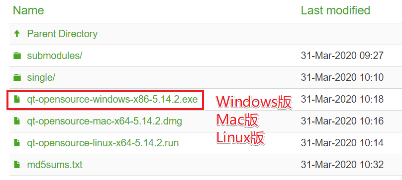

## 2.1 安装步骤

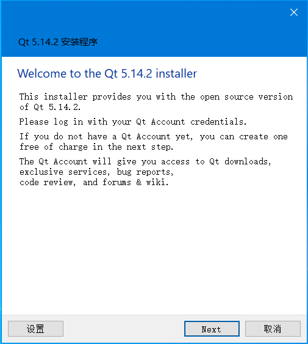

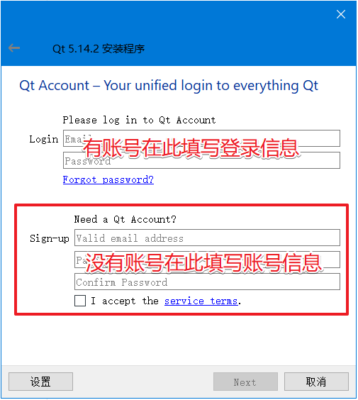

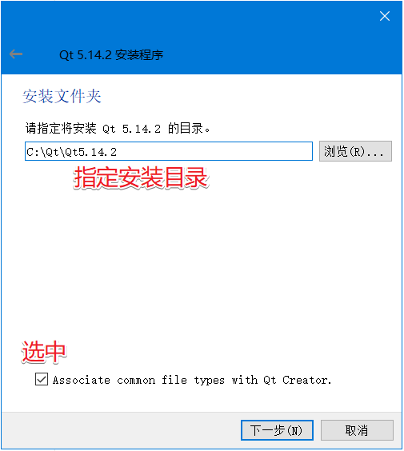

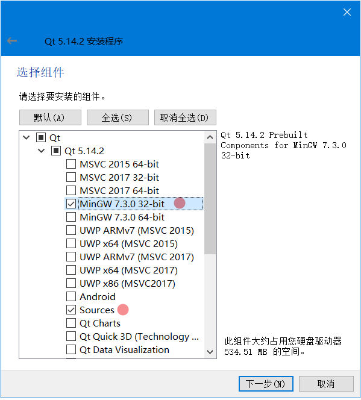

- MSVC2015 64-bit: Visual Studio 2015 使用的64位编译套件

- MSVC2017 32-bit: Visual Studio 2017 使用的32位编译套件

- MSVC2017 64-bit: Visual Studio 2017 使用的64位编译套件

- MinGW7.3.0 32-bit: QtCreator 使用的32位编译套件

- MinGW7.3.0 64-bit: QtCreator 使用的64位编译套件

- UWP --> Universal Windows Platform: 用于window平台应用程序开发的编译套件 

  > 即Windows通用应用平台，在`Windows 10 Mobile`/`Surface（Windows平板电脑）`/ `PC`/`Xbox`/`HoloLens`等平台上运行，uwp不同于传统pc上的exe应用，也跟只适用于手机端的app有本质区别。它并不是为某一个终端而设计，而是可以在所有Windows10设备上运行

- Source: Qt源码, Qt的一些模块运行需要的驱动没有提供现成的动态库需要自己编译, 建议安装

- Qt Charts: 用于绘制统计数据对应的图表, 比如: 折线图/曲线图等

> 我只选择安装了 `MinGW7.3.0 32-bit` 和 `Source`两部分, 根据向导开始进行安装, 这个过程需要漫长的等待

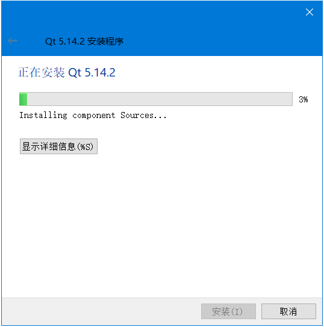


## 2.2 环境变量设置

1. 在桌面找到我的电脑（此电脑）图标，鼠标右键，打开属性窗口

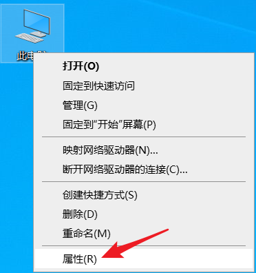

2. 在属性窗口中选择 “高级系统设置”

   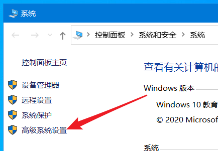

3. 打开环境变量窗口

   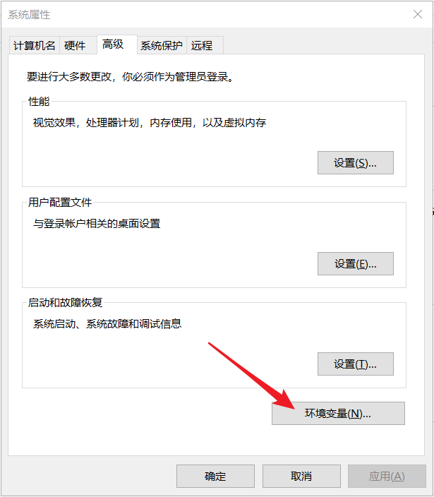

4. 新建环境变量

   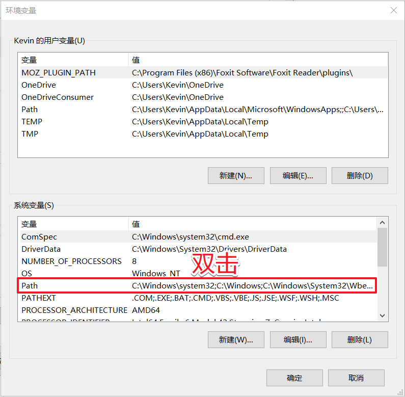

5. 将Qt的相关目录添加到系统环境变量中

   - 环境变量说明:

     - 找到Qt的安装目录: `C:`

     - 在安装目录中找到Qt库的bin目录: `C:\Qt\Qt5.14.2\5.14.2\mingw73_32\bin`
     - 在安装目录中找到编译套件的bin目录: `C:\Qt\Qt5.14.2\Tools\mingw730_32\bin`

   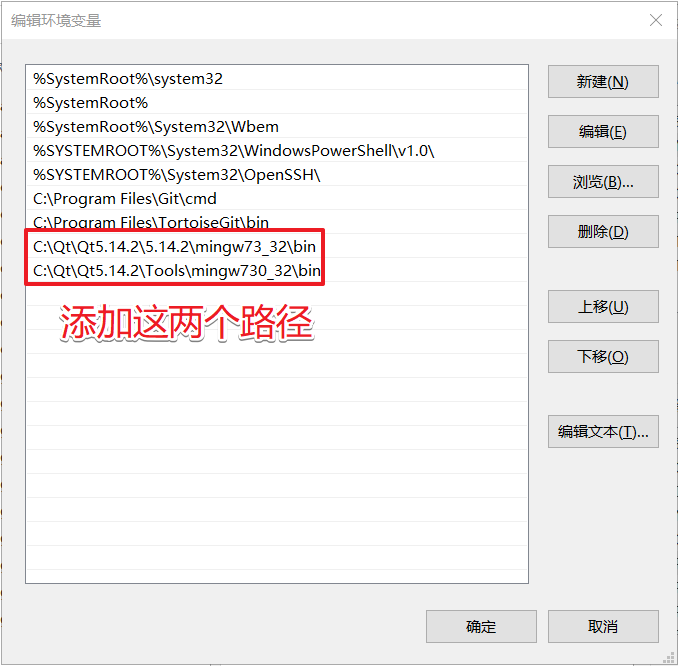


## 2.3 QtCreator

1. QtCreator是编写Qt程序默认使用的一款 IDE，使用VS写Qt程序也是可以的，在此不做介绍。

2. <font color="red">使用QtCreator创建的项目目录中不能包含中文</font>

3. <font color="red">QtCreator默认使用Utf8格式编码对文件字符进行编码</font>

   - `字符必须编码后才能被计算机处理`

   - 为了处理汉字，程序员设计了用于简体中文的GB2312和用于繁体中文的big5。

   - GB2312 支持的汉字太少，1995年的汉字扩展规范GBK1.0，支持了更多的汉字。

   - 2000年的 GB18030取代了GBK1.0成为了正式的国家标准。

   - Unicode 也是一种字符编码方法，不过它是由国际组织设计，可以容纳全世界所有语言文字的编码方案

     - utf8
     - utf16

   - vs写Qt程序默认使用的本地编码 -> gbk

   - 修改QtCreator的编码

     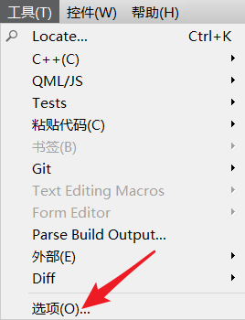

     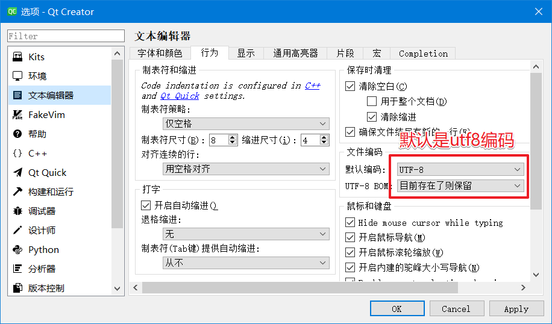

   - QtCreator主界面介绍

     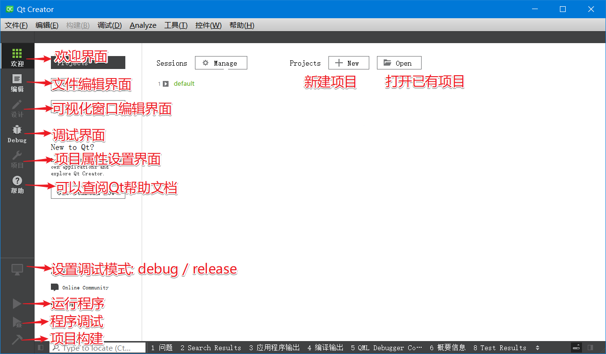

     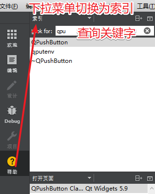

   - 默认的编译套件

     `MinGW`  ->  `Minimalist GNU for Windows`

     > - MinGW 提供了一套简单方便的Windows下的基于GCC 程序开发环境。MinGW 收集了一系列免费的Windows 使用的头文件和库文件；
     > - 整合了GNU ( http://www.gnu.org/ )的工具集，特别是GNU 程序开发工具，如经典gcc, g++, make等。
     > - MinGW是完全免费的自由软件，它在Windows平台上模拟了Linux下GCC的开发环境，为C++的跨平台开发提供了良好基础支持，为了在Windows下工作的程序员熟悉Linux下的C++工程组织提供了条件。

# 3. 创建第一个Qt项目

## 3.1 创建项目

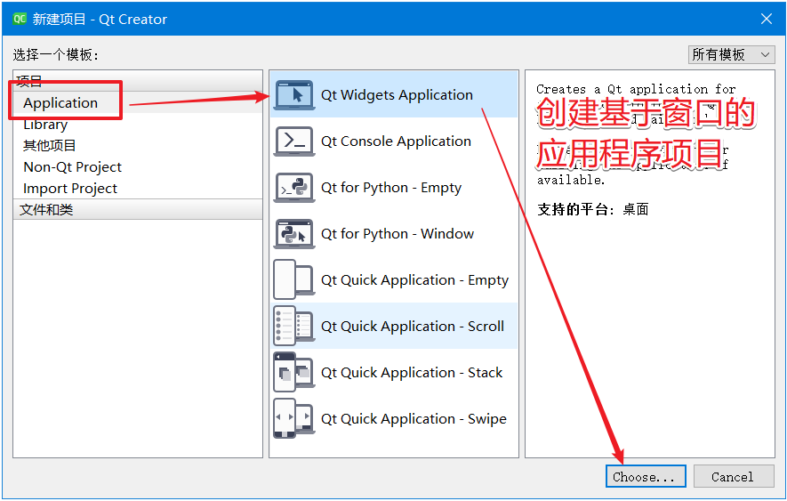

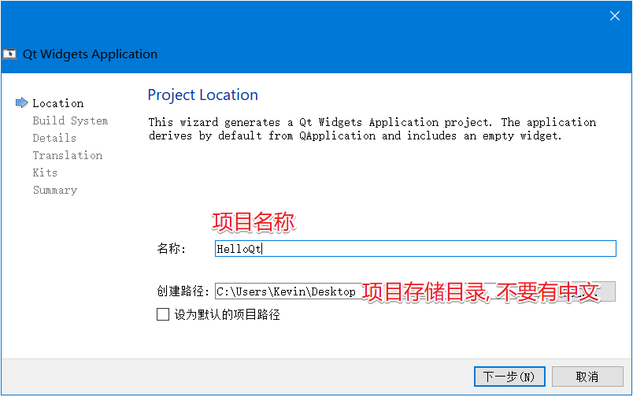

- 项目名称根据需求自己指定即可
- `在指定项目的存储路径的时候, 路径中不能包含中文, 不能包含中文, 不能包含中文`

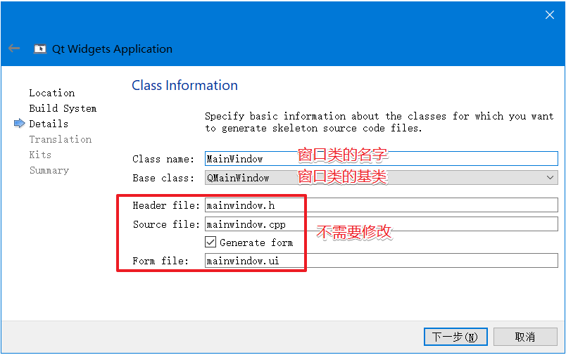

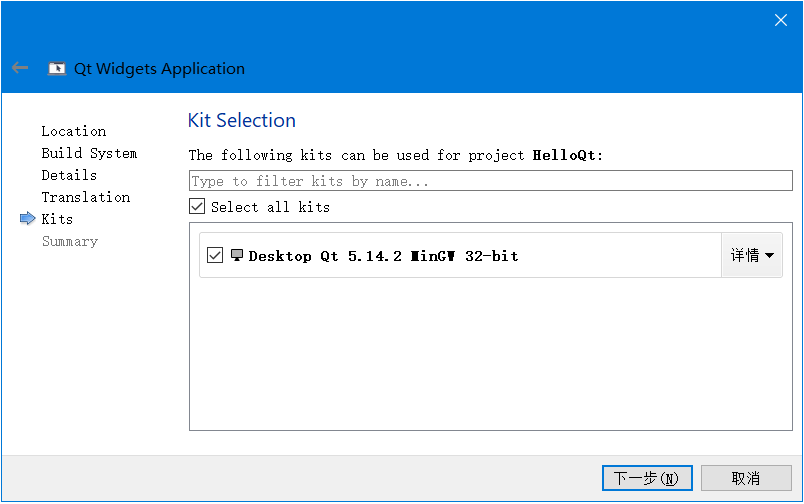

- 编译套件用于项目文件的编译, 如果安装了多个编译套件, 在这里选择其中一个就可以了

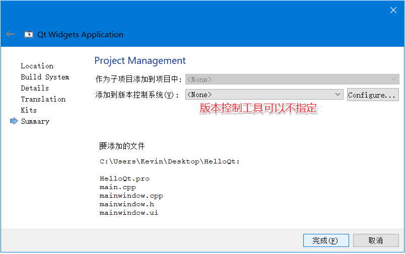


## 3.2 项目文件 .pro

```shell
# 在项目文件中, 注释需要使用 井号(#)
# 项目编译的时候需要加载哪些底层模块
QT       += core gui 

# 如果当前Qt版本大于4, 会添加一个额外的模块: widgets
# Qt 5中对gui模块进行了拆分, 将 widgets 独立出来了
greaterThan(QT_MAJOR_VERSION, 4): QT += widgets
   
# 使用c++11新特性
CONFIG += c++11	

#如果在项目中调用了废弃的函数, 项目编译的时候会有警告的提示    
DEFINES += QT_DEPRECATED_WARNINGS

# 项目中的源文件
SOURCES += \
        main.cpp \
        mainwindow.cpp
        
# 项目中的头文件
HEADERS += \
        mainwindow.h
        
# 项目中的窗口界面文件
FORMS += \
        mainwindow.ui

```


## 3.3 其他文件

- main.cpp

  ```c++
  #include "mainwindow.h"		// 生成的窗口类头文件
  #include <QApplication>		// 应用程序类头文件
  
  int main(int argc, char *argv[])
  {
      // 创建应用程序对象, 在一个Qt项目中实例对象有且仅有一个
      // 类的作用: 检测触发的事件, 进行事件循环并处理
      QApplication a(argc, argv);
      // 创建窗口类对象
      MainWindow w;
      // 显示窗口
      w.show();
      // 应用程序对象开始事件循环, 保证应用程序不退出
      return a.exec();
  }
  ```

  

- mainwindow.ui

  ```xml
  <!-- 双击这个文件看到的是一个窗口界面, 如果使用文本编辑器打开看到的是一个XML格式的文件 -->
  <!-- 看不懂这种格式没关系, 我们不需要在这种模式下操作这个文件, 这里只是给大家介绍这个文件的本质 -->
  <?xml version="1.0" encoding="UTF-8"?>
  <ui version="4.0">
   <class>MainWindow</class>
   <widget class="QMainWindow" name="MainWindow">
    <property name="geometry">
     <rect>
      <x>0</x>
      <y>0</y>
      <width>800</width>
      <height>600</height>
     </rect>
    </property>
    <property name="windowTitle">
     <string>MainWindow</string>
    </property>
    <widget class="QWidget" name="centralwidget"/>
    <widget class="QMenuBar" name="menubar"/>
    <widget class="QStatusBar" name="statusbar"/>
   </widget>
   <resources/>
   <connections/>
  </ui>
  ```

  

- mainwindow.h

  ```c++
  #ifndef MAINWINDOW_H
  #define MAINWINDOW_H
  
  #include <QMainWindow>		// Qt标准窗口类头文件
  
  QT_BEGIN_NAMESPACE
  // mainwindow.ui 文件中也有一个类叫 MainWindow, 将这个类放到命名空间 Ui 中
  namespace Ui { class MainWindow; }	
  QT_END_NAMESPACE
  
  class MainWindow : public QMainWindow
  {
      Q_OBJECT	// 这个宏是为了能够使用Qt中的信号槽机制
  
  public:
      MainWindow(QWidget *parent = nullptr);
      ~MainWindow();
  
  private:
      Ui::MainWindow *ui;		// 定义指针指向窗口的 UI 对象
  };
  #endif // MAINWINDOW_H
  ```

  

- mainwindow.cpp

  ```c++
  #include "mainwindow.h"
  #include "ui_mainwindow.h"
  
  MainWindow::MainWindow(QWidget *parent)
      : QMainWindow(parent)
      , ui(new Ui::MainWindow)	// 基于mainwindow.ui创建一个实例对象
  {
      // 将 mainwindow.ui 的实例对象和 当前类的对象进行关联
      // 这样同名的连个类对象就产生了关联, 合二为一了
      ui->setupUi(this);
  }
  
  MainWindow::~MainWindow()
  {
      delete ui;
  }
  ```

  

# 4. Qt中的窗口类

> 我们在通过Qt向导窗口基于窗口的应用程序的项目过程中倒数第二步让我们选择跟随项目创建的第一个窗口的基类, 下拉菜单中有三个选项, 分别为: `QMainWindow`、`QDialog`、`QWidget`如下图：

## 4.1 基础窗口类

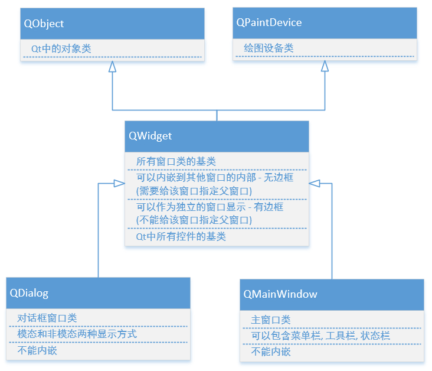

- 常用的窗口类有3个
  - 在创建Qt窗口的时候, 需要让自己的窗口类继承上述三个窗口类的其中一个
- QWidget
  - 所有窗口类的基类
  - Qt中的控件(按钮, 输入框, 单选框...)也属于窗口, 基类都是`QWidget`
  - 可以内嵌到其他窗口中:  没有边框
  - 可以不内嵌单独显示: 独立的窗口, 有边框
- QDialog
  - 对话框类, 后边的章节会具体介绍这个窗口
  - 不能内嵌到其他窗口中
- QMainWindow
  - 有工具栏, 状态栏, 菜单栏, 后边的章节会具体介绍这个窗口
  - 不能内嵌到其他窗口中

## 4.2 窗口的显示

- 内嵌窗口 

  - 依附于某一个大的窗口, 作为了大窗口的一部分
  - 大窗口就是这个内嵌窗口的父窗口
  - `父窗口显示的时候, 内嵌的窗口也就被显示出来了`

- 不内嵌窗口 

  - 这类窗口有边框, 有标题栏

  - 需要调用函数才可以显示

    ```c++
    // QWidget是所有窗口类的基类, 调用这个提供的 show() 方法就可以显示将任何窗口显示出来
    // 非模态显示
    void QWidget::show();	// 显示当前窗口和它的子窗口
    
    // 对话框窗口的非模态显示: 还是调用show() 方法
    // 对话框窗口的模态显示
    [virtual slot] int QDialog::exec();
    ```

 


# 5. Qt的坐标体系

## 5.1 窗口的坐标原点

`Qt的坐标原点在窗口的左上角`

- x轴向右递增
- y轴向下递增

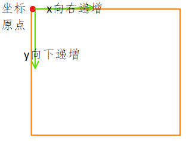


## 5.2 窗口的相对坐标

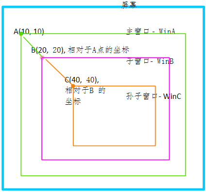

- 在Qt的某一个窗口中有可能有若干个控件, 这个控件都是嵌套的关系
  
  - A窗口包含B窗口, B窗口包含C窗口
- 每个窗口都有坐标原点, 在左上角
  
  - 子窗口的位置是基于父窗口的坐标体系来确定的, 也就是说通过父窗口左上角的坐标点来确定自己的位置
- Qt中窗口显示的时候使用的相对坐标, 相对于自己的父窗口

- 将子窗口移动到父窗口的某个位置

  ```c++
  // 所有窗口类的基类: QWidget
  // QWidget中提供了移动窗口的 API函数
  // 参数 x, y是要移动的窗口的左上角的点, 窗口的左上角移动到这个坐标点
  void move(int x, int y);
  void move(const QPoint &);
  
  ```

  

# 6. Qt中的内存回收机制

> 在Qt中创建对象的时候会提供一个 `Parent对象指针`（可以查看类的构造函数），下面来解释这个parent到底是干什么的。
>
> QObject是以对象树的形式组织起来的。`当你创建一个QObject对象时，会看到QObject的构造函数接收一个QObject指针作为参数，这个参数就是 parent，也就是父对象指针`。这相当于，在创建QObject对象时，可以提供一个其父对象，我们创建的这个QObject对象会自动添加到其父对象的children()列表。当父对象析构的时候，这个列表中的所有对象也会被析构。（注意，`这里的父对象并不是继承意义上的父类！`）
>
> QWidget是能够在屏幕上显示的一切组件的父类。QWidget继承自QObject，因此也继承了这种对象树关系。一个孩子自动地成为父组件的一个子组件。因此，它会显示在父组件的坐标系统中，被父组件的边界剪裁。例如，当用户关闭一个对话框的时候，应用程序将其删除，那么，我们希望属于这个对话框的按钮、图标等应该一起被删除。事实就是如此，因为这些都是对话框的子组件。
>
> Qt 引入对象树的概念，在一定程度上解决了内存问题。
>
> - 当一个QObject对象在堆上创建的时候，Qt 会同时为其创建一个对象树。不过，对象树中对象的顺序是没有定义的。这意味着，销毁这些对象的顺序也是未定义的。
>
> - 任何对象树中的 QObject对象 delete 的时候，如果这个对象有 parent，则自动将其从 parent 的children()列表中删除；如果有孩子，则自动 delete 每一个孩子。Qt 保证没有QObject会被 delete 两次，这是由析构顺序决定的。

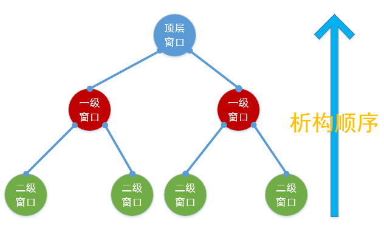

综上所述, 我们可以得到一个结论: `Qt中有内存回收机制, 但是不是所有被new出的对象被自动回收, 满足条件才可以回收`, 如果想要在Qt中实现内存的自动回收, 需要满足以下两个条件:

- 创建的对象必须是QObject类的子类(间接子类也可以)

  - QObject类是没有父类的, Qt中有很大一部分类都是从这个类派生出去的

    - Qt中使用频率很高的窗口类和控件都是 QObject 的直接或间接的子类
    - 其他的类可以自己查阅Qt帮助文档

- 创建出的类对象, 必须要指定其父对象是谁, 一般情况下有两种操作方式:

  ```c++
  // 方式1: 通过构造函数
  // parent: 当前窗口的父对象, 找构造函数中的 parent 参数即可
  QWidget::QWidget(QWidget *parent = Q_NULLPTR, Qt::WindowFlags f = Qt::WindowFlags());
  QTimer::QTimer(QObject *parent = nullptr);
  
  // 方式2: 通过setParent()方法
  // 假设这个控件没有在构造的时候指定符对象, 可以调用QWidget的api指定父窗口对象
  void QWidget::setParent(QWidget *parent);
void QObject::setParent(QObject *parent);
  ```
  
  