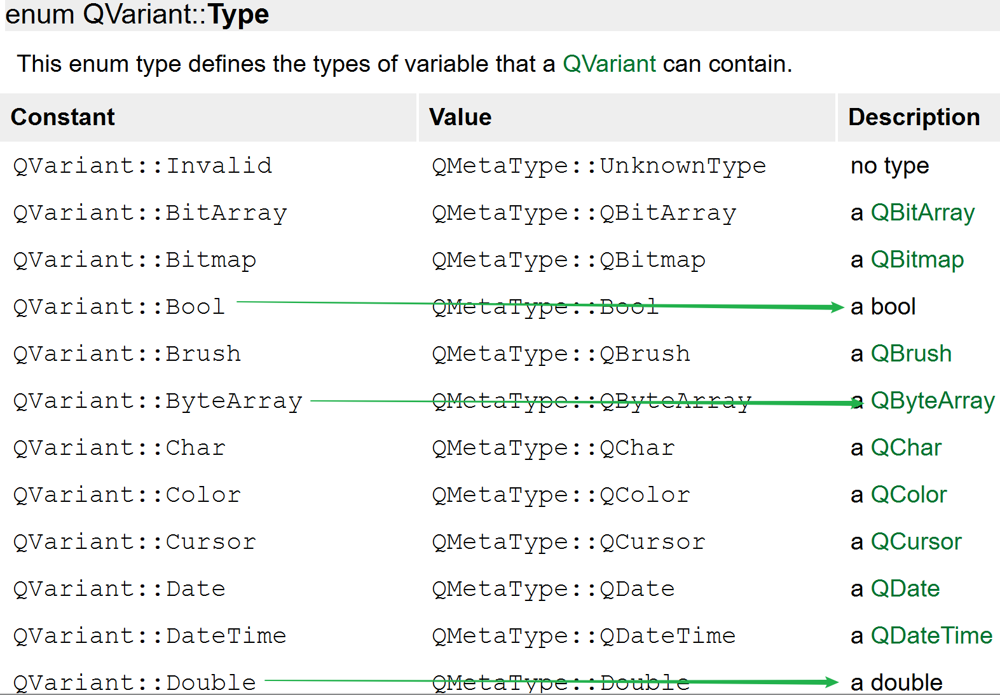

# 1. 基础类型

因为Qt是一个C++框架, 因此C++中所有的语法和数据类型在Qt中都是被支持的, 但是Qt中也定义了一些属于自己的数据类型, 下边给大家介绍一下这些基础的数类型。

QT基本数据类型定义在`#include <QtGlobal>` 中，QT基本数据类型有：

| 类型名称   | 注释                                         | 备注                                                         |
| ---------- | -------------------------------------------- | ------------------------------------------------------------ |
| qint8      | signed char                                  | 有符号8位数据                                                |
| qint16     | signed short                                 | 16位数据类型                                                 |
| qint32     | signed short                                 | 32位有符号数据类型                                           |
| qint64     | long long int 或(__int64)                    | 64位有符号数据类型，Windows中定义为__int64                   |
| qintptr    | qint32 或 qint64                             | 指针类型 根据系统类型不同而不同，32位系统为qint32、64位系统为qint64 |
| qlonglong  | long long int 或(__int64)                    | Windows中定义为__int64                                       |
| qptrdiff   | qint32 或 qint64                             | 根据系统类型不同而不同，32位系统为qint32、64位系统为qint64   |
| qreal      | double 或 float                              | 除非配置了-qreal float选项，否则默认为double                 |
| quint8     | unsigned char                                | 无符号8位数据类型                                            |
| quint16    | unsigned short                               | 无符号16位数据类型                                           |
| quint32    | unsigned int                                 | 无符号32位数据类型                                           |
| quint64    | unsigned long long int 或 (unsigned __int64) | 无符号64比特数据类型，Windows中定义为unsigned __int64        |
| quintptr   | quint32 或 quint64                           | 根据系统类型不同而不同，32位系统为quint32、64位系统为quint64 |
| qulonglong | unsigned long long int 或 (unsigned __int64) | Windows中定义为__int64                                       |
| uchar      | unsigned char                                | 无符号字符类型                                               |
| uint       | unsigned int                                 | 无符号整型                                                   |
| ulong      | unsigned long                                | 无符号长整型                                                 |
| ushort     | unsigned short                               | 无符号短整型                                                 |


# 2. log输出

> 在Qt中进行log输出, 一般不使用c中的`printf`, 也不是使用C++中的`cout`, Qt框架提供了专门用于日志输出的类, 头文件名为 `QDebug`, 使用方法如下:

```c++
// 包含了QDebug头文件, 直接通过全局函数 qDebug() 就可以进行日志输出了
qDebug() << "Date:" << QDate::currentDate();
qDebug() << "Types:" << QString("String") << QChar('x') << QRect(0, 10, 50, 40);
qDebug() << "Custom coordinate type:" << coordinate;

// 和全局函数 qDebug() 类似的日志函数还有: qWarning(), qInfo(), qCritical()
int number = 666;
float i = 11.11;
qWarning() << "Number:" << number << "Other value:" << i;
qInfo() << "Number:" << number << "Other value:" << i;
qCritical() << "Number:" << number << "Other value:" << i;
```


# 3. 字符串类型

> c     => `char*`
>
> c++ => `std::string`
>
> Qt	=> `QByteArray`, `QString`

## 3.1 QByteArray

> 在Qt中`QByteArray`可以看做是c语言中 `char*`的升级版本。我们在使用这种类型的时候可通过这个类的构造函数申请一块动态内存，用于存储我们需要处理的字符串数据。
>
> 下面给大家介绍一下这个类中常用的一些API函数，`大家要养成遇到问题主动查询帮助文档的好习惯`

- 构造函数

  ```c++
  // 构造空对象, 里边没有数据
  QByteArray::QByteArray();
  // 将data中的size个字符进行构造, 得到一个字节数组对象
  // 如果 size==-1 函数内部自动计算字符串长度, 计算方式为: strlen(data)
  QByteArray::QByteArray(const char *data, int size = -1);
  // 构造一个长度为size个字节, 并且每个字节值都为ch的字节数组
  QByteArray::QByteArray(int size, char ch);
  ```

  

- 数据操作

  ```c++
  // 在尾部追加数据
  // 其他重载的同名函数可参考Qt帮助文档, 此处略
  QByteArray &QByteArray::append(const QByteArray &ba);
  void QByteArray::push_back(const QByteArray &other);
  
  // 头部添加数据
  // 其他重载的同名函数可参考Qt帮助文档, 此处略
  QByteArray &QByteArray::prepend(const QByteArray &ba);
  void QByteArray::push_front(const QByteArray &other);
  
  // 插入数据, 将ba插入到数组第 i 个字节的位置(从0开始)
  // 其他重载的同名函数可参考Qt帮助文档, 此处略
  QByteArray &QByteArray::insert(int i, const QByteArray &ba);
  
  // 删除数据
  // 从大字符串中删除len个字符, 从第pos个字符的位置开始删除
  QByteArray &QByteArray::remove(int pos, int len);
  // 从字符数组的尾部删除 n 个字节
  void QByteArray::chop(int n);
  // 从字节数组的 pos 位置将数组截断 (前边部分留下, 后边部分被删除)
  void QByteArray::truncate(int pos);
  // 将对象中的数据清空, 使其为null
  void QByteArray::clear();
  
  // 字符串替换
  // 将字节数组中的 子字符串 before 替换为 after
  // 其他重载的同名函数可参考Qt帮助文档, 此处略
  QByteArray &QByteArray::replace(const QByteArray &before, const QByteArray &after);
  ```

- 子字符串查找和判断

  ```c++
  // 判断字节数组中是否包含子字符串 ba, 包含返回true, 否则返回false
  bool QByteArray::contains(const QByteArray &ba) const;
  bool QByteArray::contains(const char *ba) const;
  // 判断字节数组中是否包含子字符 ch, 包含返回true, 否则返回false
  bool QByteArray::contains(char ch) const;
  
  // 判断字节数组是否以字符串 ba 开始, 是返回true, 不是返回false
  bool QByteArray::startsWith(const QByteArray &ba) const;
  bool QByteArray::startsWith(const char *ba) const;
  // 判断字节数组是否以字符 ch 开始, 是返回true, 不是返回false
  bool QByteArray::startsWith(char ch) const;
  
  // 判断字节数组是否以字符串 ba 结尾, 是返回true, 不是返回false
  bool QByteArray::endsWith(const QByteArray &ba) const;
  bool QByteArray::endsWith(const char *ba) const;
  // 判断字节数组是否以字符 ch 结尾, 是返回true, 不是返回false
  bool QByteArray::endsWith(char ch) const;
  ```

  

- 遍历

  ```c++
  // 使用迭代器
  iterator QByteArray::begin();
  iterator QByteArray::end();
  
  // 使用数组的方式进行遍历
  // i的取值范围 0 <= i < size()
  char QByteArray::at(int i) const;
  char QByteArray::operator[](int i) const;
  
  ```

  

- 查看字节数

  ```c++
  // 返回字节数组对象中字符的个数
  int QByteArray::length() const;
  int QByteArray::size() const;
  int QByteArray::count() const;
  
  // 返回字节数组对象中 子字符串ba 出现的次数
  int QByteArray::count(const QByteArray &ba) const;
  int QByteArray::count(const char *ba) const;
  // 返回字节数组对象中 字符串ch 出现的次数
  int QByteArray::count(char ch) const;
  ```

- 类型转换

  ```c++
  // 将QByteArray类型的字符串 转换为 char* 类型
  char *QByteArray::data();
  const char *QByteArray::data() const;
  
  // int, short, long, float, double -> QByteArray
  // 其他重载的同名函数可参考Qt帮助文档, 此处略
  QByteArray &QByteArray::setNum(int n, int base = 10);
  QByteArray &QByteArray::setNum(short n, int base = 10);
  QByteArray &QByteArray::setNum(qlonglong n, int base = 10);
  QByteArray &QByteArray::setNum(float n, char f = 'g', int prec = 6);
  QByteArray &QByteArray::setNum(double n, char f = 'g', int prec = 6);
  [static] QByteArray QByteArray::number(int n, int base = 10);
  [static] QByteArray QByteArray::number(qlonglong n, int base = 10);
  [static] QByteArray QByteArray::number(double n, char f = 'g', int prec = 6);
  
  // QByteArray -> int, short, long, float, double
  int QByteArray::toInt(bool *ok = Q_NULLPTR, int base = 10) const;
  short QByteArray::toShort(bool *ok = Q_NULLPTR, int base = 10) const;
  long QByteArray::toLong(bool *ok = Q_NULLPTR, int base = 10) const;
  float QByteArray::toFloat(bool *ok = Q_NULLPTR) const;
  double QByteArray::toDouble(bool *ok = Q_NULLPTR) const;
  
  // std::string -> QByteArray
  [static] QByteArray QByteArray::fromStdString(const std::string &str);
  // QByteArray -> std::string
  std::string QByteArray::toStdString() const;
  
  // 所有字符转换为大写
  QByteArray QByteArray::toUpper() const;
  // 所有字符转换为小写
  QByteArray QByteArray::toLower() const;
  ```

  

## 3.2 QString

> QString也是封装了字符串, 但是内部的编码为`utf8`, UTF-8属于Unicode字符集, 它固定使用多个字节（window为2字节, linux为3字节）来表示一个字符，这样可以将世界上几乎所有语言的常用字符收录其中。
>
> 下面给大家介绍一下这个类中常用的一些API函数。

- 构造函数

  ```c++
  // 构造一个空字符串对象
  QString::QString();
  // 将 char* 字符串 转换为 QString 类型
  QString::QString(const char *str);
  // 将 QByteArray 转换为 QString 类型
  QString::QString(const QByteArray &ba);
  // 其他重载的同名构造函数可参考Qt帮助文档, 此处略
  ```

  

- 数据操作

  ```c++
  // 尾部追加数据
  // 其他重载的同名函数可参考Qt帮助文档, 此处略
  QString &QString::append(const QString &str);
  QString &QString::append(const char *str);
  QString &QString::append(const QByteArray &ba);
  void QString::push_back(const QString &other);
  
  // 头部添加数据
  // 其他重载的同名函数可参考Qt帮助文档, 此处略
  QString &QString::prepend(const QString &str);
  QString &QString::prepend(const char *str);
  QString &QString::prepend(const QByteArray &ba);
  void QString::push_front(const QString &other);
  
  // 插入数据, 将 str 插入到字符串第 position 个字符的位置(从0开始)
  // 其他重载的同名函数可参考Qt帮助文档, 此处略
  QString &QString::insert(int position, const QString &str);
  QString &QString::insert(int position, const char *str);
  QString &QString::insert(int position, const QByteArray &str);
  
  // 删除数据
  // 从大字符串中删除len个字符, 从第pos个字符的位置开始删除
  QString &QString::remove(int position, int n);
  
  // 从字符串的尾部删除 n 个字符
  void QString::chop(int n);
  // 从字节串的 position 位置将字符串截断 (前边部分留下, 后边部分被删除)
  void QString::truncate(int position);
  // 将对象中的数据清空, 使其为null
  void QString::clear();
  
  // 字符串替换
  // 将字节数组中的 子字符串 before 替换为 after
  // 参数 cs 为是否区分大小写, 默认区分大小写
  // 其他重载的同名函数可参考Qt帮助文档, 此处略
  QString &QString::replace(const QString &before, const QString &after, Qt::CaseSensitivity cs = Qt::CaseSensitive);
  ```

- 子字符串查找和判断

  ```c++
  // 参数 cs 为是否区分大小写, 默认区分大小写
  // 其他重载的同名函数可参考Qt帮助文档, 此处略
  
  // 判断字符串中是否包含子字符串 str, 包含返回true, 否则返回false
  bool QString::contains(const QString &str, Qt::CaseSensitivity cs = Qt::CaseSensitive) const;
  
  // 判断字符串是否以字符串 ba 开始, 是返回true, 不是返回false
  bool QString::startsWith(const QString &s, Qt::CaseSensitivity cs = Qt::CaseSensitive) const;
  
  // 判断字符串是否以字符串 ba 结尾, 是返回true, 不是返回false
  bool QString::endsWith(const QString &s, Qt::CaseSensitivity cs = Qt::CaseSensitive) const;
  ```

- 遍历

  ```c++
  // 使用迭代器
  iterator QString::begin();
  iterator QString::end();
  
  // 使用数组的方式进行遍历
  // i的取值范围 0 <= position < size()
  const QChar QString::at(int position) const
  const QChar QString::operator[](int position) const;
  ```

- 查看字节数

  ```c++
  // 返回字节数组对象中字符的个数
  int QString::length() const;
  int QString::size() const;
  int QString::count() const;
  
  // 返回字节串对象中 子字符串 str 出现的次数
  // 参数 cs 为是否区分大小写, 默认区分大小写
  int QString::count(const QStringRef &str, Qt::CaseSensitivity cs = Qt::CaseSensitive) const;
  ```

- 类型转换

  ```c++
  // int, short, long, float, double -> QString
  // 其他重载的同名函数可参考Qt帮助文档, 此处略
  QString &QString::setNum(int n, int base = 10);
  QString &QString::setNum(short n, int base = 10);
  QString &QString::setNum(long n, int base = 10);
  QString &QString::setNum(float n, char format = 'g', int precision = 6);
  QString &QString::setNum(double n, char format = 'g', int precision = 6);
  [static] QString QString::number(long n, int base = 10);
  [static] QString QString::number(int n, int base = 10);
  [static] QString QString::number(double n, char format = 'g', int precision = 6);
  
  // QString -> int, short, long, float, double
  int QString::toInt(bool *ok = Q_NULLPTR, int base = 10) const;
  short QString::toShort(bool *ok = Q_NULLPTR, int base = 10) const;
  long QString::toLong(bool *ok = Q_NULLPTR, int base = 10) const
  float QString::toFloat(bool *ok = Q_NULLPTR) const;
  double QString::toDouble(bool *ok = Q_NULLPTR) const;
  
  // std::string -> QString
  [static] QString QString::fromStdString(const std::string &str);
  // QString -> std::string
  std::string QString::toStdString() const;
  
  // QString -> QByteArray
  // 转换为本地编码, 跟随操作系统
  QByteArray QString::toLocal8Bit() const;
  // 转换为 Latin-1 编码的字符串 不支持中文
  QByteArray QString::toLatin1() const;
  // 转换为 utf8 编码格式的字符串 (常用)
  QByteArray QString::toUtf8() const;
  
  // 所有字符转换为大写
  QString QString::toUpper() const;
  // 所有字符转换为小写
  QString QString::toLower() const;
  ```

- 字符串格式

  ```c++
  // 其他重载的同名函数可参考Qt帮助文档, 此处略
  QString QString::arg(const QString &a, int fieldWidth = 0, QChar fillChar = QLatin1Char( ' ' )) const;
  QString QString::arg(int a, int fieldWidth = 0, int base = 10, QChar fillChar = QLatin1Char( ' ' )) const;
  
  // 示例程序
  int i;           // current file's number
  int total;       // number of files to process
  QString fileName;    // current file's name
  
  QString status = QString("Processing file %1 of %2: %3")
                    .arg(i).arg(total).arg(fileName);
  ```

  

# 4. QVariant

> QVariant这个类很神奇，或者说方便。很多时候，需要几种不同的数据类型需要传递，如果用结构体，又不大方便，容器保存的也只是一种数据类型，而QVariant则可以统统搞定。
>
> QVariant 这个类型充当着最常见的数据类型的联合。QVariant 可以保存很多Qt的数据类型，包括`QBrush、QColor、QCursor、QDateTime、QFont、QKeySequence、 QPalette、QPen、QPixmap、QPoint、QRect、QRegion、QSize和QString`，并且还有C++基本类型，如` int、float`等。

## 4.1 标准类型

- 将标准类型转换为QVariant类型

  ```c++
  // 这类转换需要使用QVariant类的构造函数, 由于比较多, 大家可自行查阅Qt帮助文档, 在这里简单写几个
  QVariant::QVariant(int val);
  QVariant::QVariant(bool val);
  QVariant::QVariant(double val);
  QVariant::QVariant(const char *val);
  QVariant::QVariant(const QByteArray &val);
  QVariant::QVariant(const QString &val);
  ......
      
  // 使用设置函数也可以将支持的类型的数据设置到QVariant对象中
  // 这里的 T 类型, 就是QVariant支持的类型
  void QVariant::setValue(const T &value);
  // 该函数行为和 setValue() 函数完全相同
  [static] QVariant QVariant::fromValue(const T &value);
  // 例子:
  #if 1
  QVariant v;
  v.setValue(5);
  #else
  QVariant v = QVariant::fromValue(5);
  #endif
  
  int i = v.toInt();          // i is now 5
  QString s = v.toString();   // s is now "5"
  ```

- 判断 QVariant中封装的实际数据类型

  ```c++
  // 该函数的返回值是一个枚举类型, 可通过这个枚举判断出实际是什么类型的数据
  Type QVariant::type() const;
  ```

  > 返回值`Type`的部分枚举定义, 全部信息可以自行查阅Qt帮助文档

  

- 将QVariant对象转换为实际的数据类型

  ```c++
  // 如果要实现该操作, 可以使用QVariant类提供的 toxxx() 方法, 全部转换可以参考Qt帮助文档
  // 在此举列举几个常用函数:
  bool QVariant::toBool() const;
  QByteArray QVariant::toByteArray() const;
  double QVariant::toDouble(bool *ok = Q_NULLPTR) const;
  float QVariant::toFloat(bool *ok = Q_NULLPTR) const;
  int QVariant::toInt(bool *ok = Q_NULLPTR) const;
  QString QVariant::toString() const;
  ......
  ```

  

## 4.2 自定义类型

> 除了标准类型, 我们自定义的类型也可以使用`QVariant`类进行封装, `被QVariant存储的数据类型需要有一个默认的构造函数和一个拷贝构造函数`。为了实现这个功能，首先必须使用`Q_DECLARE_METATYPE()`宏。通常会将这个宏放在类的声明所在头文件的下面， 原型为： 
>
> `Q_DECLARE_METATYPE(Type)`
>
> 使用的具体步骤如下: 

- 第一步: 在头文件中声明

  ```c++
  // *.h
  struct MyTest
  {
      int id;
      QString name;
  };
  // 自定义类型注册
  Q_DECLARE_METATYPE(MyTest)
  ```

- 第二步: 在源文件中定义

  ```c++
  MyTest t;
  t.name = "张三丰";
  t.num = 666;
  // 值的封装
  QVariant vt = QVariant::fromValue(t);
  
  // 值的读取
  if(vt.canConvert<MyTest>())
  {
      MyTest t = vt.value<MyTest>();
      qDebug() << "name: " << t.name << ", num: " << t.num;
  }
  ```


操作涉及的API如下:

```c++
// Returns true if the variant can be converted to the template type T, otherwise false.
// 如果当前QVariant对象可用转换为对应的模板类型 T, 返回true, 否则返回false
bool QVariant::canConvert() const;
// 将当前QVariant对象转换为实际的 T 类型
T QVariant::value() const;
```


# 5. 位置和尺寸

> 在QT中我们常见的 点, 线, 尺寸, 矩形 都被进行了封装, 下边依次为大家介绍相关的类。

## 5.1 QPoint

> `QPoint`类封装了我们常用用到的坐标点 (x, y), 常用的 API如下:

```c++
// 构造函数
// 构造一个坐标原点, 即(0, 0)
QPoint::QPoint();
// 参数为 x轴坐标, y轴坐标
QPoint::QPoint(int xpos, int ypos);

// 设置x轴坐标
void QPoint::setX(int x);
// 设置y轴坐标
void QPoint::setY(int y);

// 得到x轴坐标
int QPoint::x() const;
// 得到x轴坐标的引用
int &QPoint::rx();
// 得到y轴坐标
int QPoint::y() const;
// 得到y轴坐标的引用
int &QPoint::ry();

// 直接通过坐标对象进行算术运算: 加减乘除
QPoint &QPoint::operator*=(float factor);
QPoint &QPoint::operator*=(double factor);
QPoint &QPoint::operator*=(int factor);
QPoint &QPoint::operator+=(const QPoint &point);
QPoint &QPoint::operator-=(const QPoint &point);
QPoint &QPoint::operator/=(qreal divisor);

// 其他API请自行查询Qt帮助文档, 不要犯懒哦哦哦哦哦......
```

## 5.2 QLine

> `QLine`是一个直线类, 封装了两个坐标点 (`两点确定一条直线`)
>
> 常用API如下:

```c++
// 构造函数
// 构造一个空对象
QLine::QLine();
// 构造一条直线, 通过两个坐标点
QLine::QLine(const QPoint &p1, const QPoint &p2);
// 从点 (x1, y1) 到 (x2, y2)
QLine::QLine(int x1, int y1, int x2, int y2);

// 给直线对象设置坐标点
void QLine::setPoints(const QPoint &p1, const QPoint &p2);
// 起始点(x1, y1), 终点(x2, y2)
void QLine::setLine(int x1, int y1, int x2, int y2);
// 设置直线的起点坐标
void QLine::setP1(const QPoint &p1);
// 设置直线的终点坐标
void QLine::setP2(const QPoint &p2);

// 返回直线的起始点坐标
QPoint QLine::p1() const;
// 返回直线的终点坐标
QPoint QLine::p2() const;
// 返回值直线的中心点坐标, (p1() + p2()) / 2
QPoint QLine::center() const;

// 返回值直线起点的 x 坐标
int QLine::x1() const;
// 返回值直线终点的 x 坐标
int QLine::x2() const;
// 返回值直线起点的 y 坐标
int QLine::y1() const;
// 返回值直线终点的 y 坐标
int QLine::y2() const;

// 用给定的坐标点平移这条直线
void QLine::translate(const QPoint &offset);
void QLine::translate(int dx, int dy);
// 用给定的坐标点平移这条直线, 返回平移之后的坐标点
QLine QLine::translated(const QPoint &offset) const;
QLine QLine::translated(int dx, int dy) const;

// 直线对象进行比较
bool QLine::operator!=(const QLine &line) const;
bool QLine::operator==(const QLine &line) const;

// 其他API请自行查询Qt帮助文档, 不要犯懒哦哦哦哦哦......
```


## 5.3 QSize

> 在QT中`QSize`类用来形容长度和宽度, 常用的API如下:

```c++
// 构造函数
// 构造空对象, 对象中的宽和高都是无效的
QSize::QSize();
// 使用宽和高构造一个有效对象
QSize::QSize(int width, int height);

// 设置宽度
void QSize::setWidth(int width)
// 设置高度
void QSize::setHeight(int height);

// 得到宽度
int QSize::width() const;
// 得到宽度的引用
int &QSize::rwidth();
// 得到高度
int QSize::height() const;
// 得到高度的引用
int &QSize::rheight();

// 交换高度和宽度的值
void QSize::transpose();
// 交换高度和宽度的值, 返回交换之后的尺寸信息
QSize QSize::transposed() const;

// 进行算法运算: 加减乘除
QSize &QSize::operator*=(qreal factor);
QSize &QSize::operator+=(const QSize &size);
QSize &QSize::operator-=(const QSize &size);
QSize &QSize::operator/=(qreal divisor);

// 其他API请自行查询Qt帮助文档, 不要犯懒哦哦哦哦哦......
```


## 5.4 QRect

> 在Qt中使用 `QRect`类来描述一个矩形, 常用的API如下:

```c++
// 构造函数
// 构造一个空对象
QRect::QRect();
// 基于左上角坐标, 和右下角坐标构造一个矩形对象
QRect::QRect(const QPoint &topLeft, const QPoint &bottomRight);
// 基于左上角坐标, 和 宽度, 高度构造一个矩形对象
QRect::QRect(const QPoint &topLeft, const QSize &size);
// 通过 左上角坐标(x, y), 和 矩形尺寸(width, height) 构造一个矩形对象
QRect::QRect(int x, int y, int width, int height);

// 设置矩形的尺寸信息, 左上角坐标不变
void QRect::setSize(const QSize &size);
// 设置矩形左上角坐标为(x,y), 大小为(width, height)
void QRect::setRect(int x, int y, int width, int height);
// 设置矩形宽度
void QRect::setWidth(int width);
// 设置矩形高度
void QRect::setHeight(int height);

// 返回值矩形左上角坐标
QPoint QRect::topLeft() const;
// 返回矩形右上角坐标
// 该坐标点值为: QPoint(left() + width() -1, top())
QPoint QRect::topRight() const;
// 返回矩形左下角坐标
// 该坐标点值为: QPoint(left(), top() + height() - 1)
QPoint QRect::bottomLeft() const;
// 返回矩形右下角坐标
// 该坐标点值为: QPoint(left() + width() -1, top() + height() - 1)
QPoint QRect::bottomRight() const;
// 返回矩形中心点坐标
QPoint QRect::center() const;

// 返回矩形上边缘y轴坐标
int QRect::top() const;
int QRect::y() const;
// 返回值矩形下边缘y轴坐标
int QRect::bottom() const;
// 返回矩形左边缘 x轴坐标
int QRect::x() const;
int QRect::left() const;
// 返回矩形右边缘x轴坐标
int QRect::right() const;

// 返回矩形的高度
int QRect::width() const;
// 返回矩形的宽度
int QRect::height() const;
// 返回矩形的尺寸信息
QSize QRect::size() const;

```

# 6. 日期和时间

## 6.1. QDate

```c++
// 构造函数
QDate::QDate();
QDate::QDate(int y, int m, int d);

// 公共成员函数
// 重新设置日期对象中的日期
bool QDate::setDate(int year, int month, int day);
// 给日期对象添加 ndays 天
QDate QDate::addDays(qint64 ndays) const;
// 给日期对象添加 nmonths 月
QDate QDate::addMonths(int nmonths) const;
// 给日期对象添加 nyears 月
QDate QDate::addYears(int nyears) const;

// 得到日期对象中的年/月/日
int QDate::year() const;
int QDate::month() const;
int QDate::day() const;
void QDate::getDate(int *year, int *month, int *day) const;

// 日期对象格式化
/*
    d 		- 	The day as a number without a leading zero (1 to 31)
    dd		-	The day as a number with a leading zero (01 to 31)
    ddd		-	The abbreviated localized day name (e.g. 'Mon' to 'Sun'). Uses the system 
                locale to localize the name, i.e. QLocale::system().
    dddd	- 	The long localized day name (e.g. 'Monday' to 'Sunday'). 
                Uses the system locale to localize the name, i.e. QLocale::system().
    M		-	The month as a number without a leading zero (1 to 12)
    MM		-	The month as a number with a leading zero (01 to 12)
    MMM		-	The abbreviated localized month name (e.g. 'Jan' to 'Dec'). 
                Uses the system locale to localize the name, i.e. QLocale::system().
    MMMM	-	The long localized month name (e.g. 'January' to 'December'). 
                Uses the system locale to localize the name, i.e. QLocale::system().
    yy		-	The year as a two digit number (00 to 99)
    yyyy	-	The year as a four digit number. If the year is negative, 
                a minus sign is prepended, making five characters.
*/
QString QDate::toString(const QString &format) const;

// 操作符重载 ==> 日期比较
bool QDate::operator!=(const QDate &d) const;
bool QDate::operator<(const QDate &d) const;
bool QDate::operator<=(const QDate &d) const;
bool QDate::operator==(const QDate &d) const;
bool QDate::operator>(const QDate &d) const;
bool QDate::operator>=(const QDate &d) const;

// 静态函数 -> 得到本地的当前日期
[static] QDate QDate::currentDate();
```


## 6.2. QTime

```c++
// 构造函数
QTime::QTime();
/*
    h 			==> must be in the range 0 to 23
    m and s 	==> must be in the range 0 to 59
    ms 			==> must be in the range 0 to 999
*/ 
QTime::QTime(int h, int m, int s = 0, int ms = 0);

// 公共成员函数
// Returns true if the set time is valid; otherwise returns false.
bool QTime::setHMS(int h, int m, int s, int ms = 0);
QTime QTime::addSecs(int s) const;
QTime QTime::addMSecs(int ms) const;

// 示例代码
  QTime n(14, 0, 0);                // n == 14:00:00
  QTime t;
  t = n.addSecs(70);                // t == 14:01:10
  t = n.addSecs(-70);               // t == 13:58:50
  t = n.addSecs(10 * 60 * 60 + 5);  // t == 00:00:05
  t = n.addSecs(-15 * 60 * 60);     // t == 23:00:00

// 从时间对象中取出 时/分/秒/毫秒
// Returns the hour part (0 to 23) of the time. Returns -1 if the time is invalid.
int QTime::hour() const;
// Returns the minute part (0 to 59) of the time. Returns -1 if the time is invalid.
int QTime::minute() const;
// Returns the second part (0 to 59) of the time. Returns -1 if the time is invalid.
int QTime::second() const;
// Returns the millisecond part (0 to 999) of the time. Returns -1 if the time is invalid.
int QTime::msec() const;


// 时间格式化
/*
	-- 时
    h	==>	The hour without a leading zero (0 to 23 or 1 to 12 if AM/PM display)
    hh	==>	The hour with a leading zero (00 to 23 or 01 to 12 if AM/PM display)
    H	==>	The hour without a leading zero (0 to 23, even with AM/PM display)
    HH	==>	The hour with a leading zero (00 to 23, even with AM/PM display)
    -- 分
    m	==>	The minute without a leading zero (0 to 59)
    mm	==>	The minute with a leading zero (00 to 59)
    -- 秒
    s	==>	The whole second, without any leading zero (0 to 59)
    ss	==>	The whole second, with a leading zero where applicable (00 to 59)
    -- 毫秒
	zzz	==>	The fractional part of the second, to millisecond precision, 
			including trailing zeroes where applicable (000 to 999).
	-- 上午或者下午
    AP or A		==>		使用AM/PM(大写) 描述上下午, 中文系统显示汉字
    ap or a		==>		使用am/pm(小写) 描述上下午, 中文系统显示汉字
*/
QString QTime::toString(const QString &format) const;

// 阶段性计时
// 过时的API函数
// 开始计时
void QTime::start();
// 计时结束
int QTime::elapsed() const;
// 重新计时
int QTime::restart();

// 推荐使用的API函数
// QElapsedTimer 类
void QElapsedTimer::start();
qint64 QElapsedTimer::restart();
qint64 QElapsedTimer::elapsed() const;


// 操作符重载 ==> 时间比较
bool QTime::operator!=(const QTime &t) const;
bool QTime::operator<(const QTime &t) const;
bool QTime::operator<=(const QTime &t) const;
bool QTime::operator==(const QTime &t) const;
bool QTime::operator>(const QTime &t) const;
bool QTime::operator>=(const QTime &t) const;

// 静态函数 -> 得到当前时间
[static] QTime QTime::currentTime();
```


## 6.3. QDateTime

```c++
// 构造函数
QDateTime::QDateTime();
QDateTime::QDateTime(const QDate &date, const QTime &time, Qt::TimeSpec spec = Qt::LocalTime);

// 公共成员函数
// 设置日期
void QDateTime::setDate(const QDate &date);
// 设置时间
void QDateTime::setTime(const QTime &time);
// 给当前日期对象追加 年/月/日/秒/毫秒, 参数可以是负数
QDateTime QDateTime::addYears(int nyears) const;
QDateTime QDateTime::addMonths(int nmonths) const;
QDateTime QDateTime::addDays(qint64 ndays) const;
QDateTime QDateTime::addSecs(qint64 s) const;
QDateTime QDateTime::addMSecs(qint64 msecs) const;

// 得到对象中的日期
QDate QDateTime::date() const;
// 得到对象中的时间
QTime QDateTime::time() const;

// 日期和时间格式, 格式字符参考QDate 和 QTime 类的 toString() 函数
QString QDateTime::toString(const QString &format) const;


// 操作符重载 ==> 日期时间对象的比较
bool QDateTime::operator!=(const QDateTime &other) const;
bool QDateTime::operator<(const QDateTime &other) const;
bool QDateTime::operator<=(const QDateTime &other) const;
bool QDateTime::operator==(const QDateTime &other) const;
bool QDateTime::operator>(const QDateTime &other) const;
bool QDateTime::operator>=(const QDateTime &other) const;

// 静态函数
// 得到当前时区的日期和时间(本地设置的时区对应的日期和时间)
[static] QDateTime QDateTime::currentDateTime();
```


