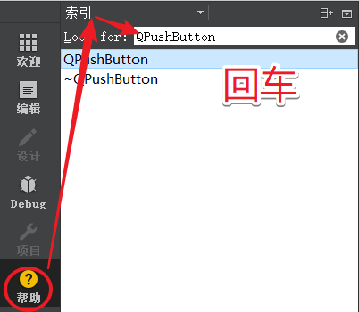
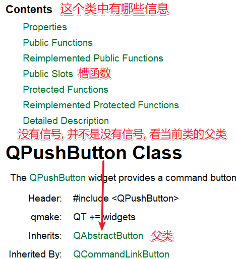
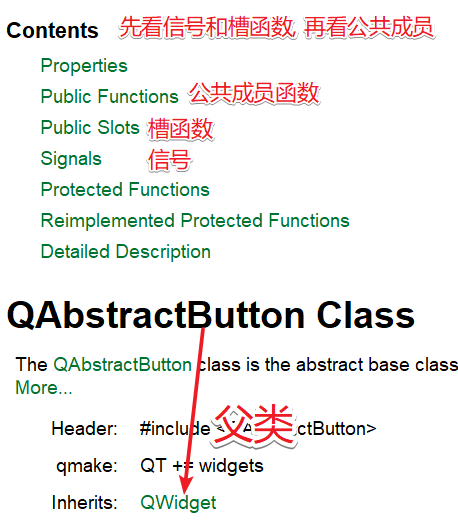

# 1. 信号和槽概述

> 信号槽是 Qt 框架引以为豪的机制之一。所谓信号槽，实际就是观察者模式(发布-订阅模式)。当某个`事件`发生之后，比如，按钮检测到自己被点击了一下，它就会发出一个信号（signal）。这种发出是没有目的的，类似广播。如果有对象对这个信号感兴趣，它就会使用连接（connect）函数，意思是，将想要处理的信号和自己的一个函数（称为槽（slot））绑定来处理这个信号。也就是说，当信号发出时，被连接的槽函数会自动被回调。这就类似观察者模式：当发生了感兴趣的事件，某一个操作就会被自动触发。

## 1.1 信号的本质

信号是由于用户对窗口或控件进行了某些操作，导致窗口或控件产生了某个特定事件，这时候Qt对应的窗口类会发出某个信号，以此对用户的挑选做出反应。

因此根据上述的描述我们得到一个结论：信号的本质就是事件，比如：

- 按钮单击、双击

- 窗口刷新

- 鼠标移动、鼠标按下、鼠标释放

- 键盘输入

那么在Qt中信号是通过什么形式呈现给使用者的呢？

- 我们对哪个窗口进行操作, 哪个窗口就可以捕捉到这些被触发的事件。
- 对于使用者来说触发了一个事件我们就可以得到Qt框架给我们发出的某个特定信号。
- 信号的呈现形式就是函数， 也就是说某个事件产生了， Qt框架就会调用某个对应的信号函数， 通知使用者。

`在QT中信号的发出者是某个实例化的类对象，对象内部可以进行相关事件的检测。`

## 1.2 槽的本质

在Qt中`槽函数是一类特殊的功能的函数`，在编码过程中`也可以作为类的普通成员函数来使用`。之所以称之为槽函数是因为它们还有一个职责就是对Qt框架中产生的信号进行处理。

举个简单的例子：

女朋友说：“我肚子饿了！”，于是我带她去吃饭。

上边例子中相当于女朋友发出了一个信号， 我收到了信号并其将其处理掉了。

- 女朋友 -> 发送信号的对象, 信号内容: 我饿了
- 我 -> 接收信号的对象并且处理掉了这个信号, 处理动作: 带她去吃饭

`在Qt中槽函数的所有者也是某个类的实例对象。`

## 1.3 信号和槽的关系

在Qt中信号和槽函数都是独立的个体，本身没有任何联系，但是由于某种特性需求我们可以将二者连接到一起，好比牛郎和织女想要相会必须要有喜鹊为他们搭桥一样。在Qt中我们需要使用`QOjbect类`中的`connect`函数进二者的关联。


```c++
QMetaObject::Connection QObject::connect(
    	const QObject *sender, PointerToMemberFunction signal, 
        const QObject *receiver, PointerToMemberFunction method, 
		Qt::ConnectionType type = Qt::AutoConnection);
- 参数:
	- sender: 发出信号的对象
	- signal: 属于sender对象, 信号是一个函数, 这个参数的类型是函数指针, 信号函数地址
    - receiver: 信号接收者
	- method: 属于receiver对象, 当检测到sender发出了signal信号, 
              receiver对象调用method方法，信号发出之后的处理动作
                  
// connect函数相对于做了信号处理动作的注册
// 调用conenct函数的sender对象的信号并没有产生, 因此receiver对象的method也不会被调用
// method槽函数本质是一个回调函数, 调用的时机是信号产生之后, 调用是Qt框架来执行的
// connect中的sender和recever两个指针必须被实例化了, 否则conenct不会成功
connect(const QObject *sender, &QObject::signal, 
        const QObject *receiver, &QObject::method);
```

 


# 2. 标准信号槽使用

## 2.1 标准信号/槽

在Qt提供的很多标准类中都可以对用户触发的某些特定事件进行检测, 因此当用户做了这些操作之后, 事件被触发类的内部就会产生对应的信号, 这些信号都是Qt类内部自带的, 因此称之为标准信号。

同样的，在Qt的很多类内部为我了提供了很多功能函数，并且这些函数也可以作为触发的信号的处理动作，有这类特性的函数在Qt中称之为标准槽函数。

系统自带的信号和槽通常如何查找呢，这个就需要利用帮助文档了，在帮助文档中比如我们上面的按钮的点击信号，在帮助文档中输入QPushButton，首先我们可以在`Contents`中寻找关键字 `signals`，信号的意思，但是我们发现并没有找到，这时候我们应该看当前类从父类继承下来了哪些信号，因此我们去他的父类QAbstractButton中就可以找到该关键字，点击signals索引到系统自带的信号有如下几个





查询父类的帮助文档



## 2.2 使用

> 功能实现： 点击窗口上的按钮, 关闭窗口
>
> - 按钮: 信号发出者 -> `QPushButton`
> - 窗口: 信号的接收者和处理者 -> `QWidget`

```c++
// 单击按钮发出的信号
[signal] void QAbstractButton::clicked(bool checked = false)
// 关闭窗口的槽函数
[slot] bool QWidget::close();

// 单击按钮关闭窗口
connect(ui->closewindow, &QPushButton::clicked, this, &MainWindow::close);
```


# 3. 自定义信号槽使用

> Qt框架提供的信号槽在某些特定场景下是无法满足我们的项目需求的，因此我们还设计自己需要的的信号和槽，同样还是使用connect()对自定义的信号槽进行连接。

```c++
/*
如果想要使用自定义的信号槽, 首先要编写新的类并且让其继承Qt的某些标准类,
我们自己编写的类想要在Qt中使用使用信号槽机制, 那么必须要满足的如下条件: 
	- 这个类必须从QObject类或者是其子类进行派生
	- 在定义类的头文件中加入 Q_OBJECT 宏
*/

// 在头文件派生类的时候，首先像下面那样引入Q_OBJECT宏：
class MyMainWindow : public QWidget
{
    Q_OBJECT
    ......
}
```


## 3.1 自定义信号

```c++
/*
要求:
	1. 信号是类的成员函数
	2. 返回值是 void 类型
	3. 信号的名字可以根据实际情况进行指定
	4. 参数可以随意指定, 信号也支持重载
	5. 信号需要使用 signals 关键字进行声明, 使用方法类似于public等关键字
	6. 信号函数只需要声明, 不需要定义(没有函数体实现)
	7. 在程序中发送自定义信号: 发送信号的本质就是调用信号函数
		- 习惯性在信号函数前加关键字: emit
		- emit只是显示的声明一下信号要被发送, 没有特殊含义
		- 底层 emit == #define emit 
*/
// 举例: 信号重载
// Qt中的类想要使用信号槽机制必须要从QObject类派生(直接或间接派生都可以)
class Test : public QObject
{
    Q_OBJECT
signals:
    void testsignal();
	// 参数的作用是数据传递, 谁调用信号函数谁就指定实参
	// 实参最终会被传递给槽函数
    void testsignal(int a);
};
```


## 3.2 自定义槽

> 槽函数就是信号的处理动作，自定义槽函数和自定义的普通函数写法是一样的。

```c++
/*
要求:
	1. 返回值是 void 类型
	2. 槽也是函数, 因此也支持重载
		- 槽函数需要指定多少个参数, 需要看连接的信号的参数个数
		- 槽函数的参数是用来接收信号发送的数据的, 信号发送的数据就是信号的参数
		- 举例:
			- 信号函数: void testsig(int a, double b);
			- 槽函数:   void testslot(int a, double b);
		- 总结:
			- 槽函数的参数应该和对应的信号的参数个数, 类型一一对应
			- 信号的参数可以大于等于槽函数的参数个数 == 信号传递的数据被忽略了
				- 信号函数: void testsig(int a, double b);
				- 槽函数:   void testslot(int a);
	3. Qt中槽函数的类型:
		- 类的成员函数
		- 全局函数
		- 静态函数
		- lambda表达式(匿名函数)
	4. 槽函数可以使用关键字进行声明: slots (Qt5中slots可以省略不写)
		- public slots:
		- private slots:
		- protected slots:
*/

// 举例
// 类中的这三个函数都可以作为槽函数来使用
class Test : public QObject
{
public:
    void testSlot();
    static void testFunc();

public slots:
    void testSlot(int id);
};
```

场景举例

```c++
// 女朋友饿了, 我请她吃饭
// class GirlFriend
// class Me
```


# 4. 信号槽拓展

## 4.1 信号槽使用拓展

- 一个信号可以连接多个槽函数, 发送一个信号有多个处理动作

  - 需要写多个`connect`连接
  - 槽函数的执行顺序是随机的, 和connect函数的调用顺序没有关系
  - 信号的接收者可以是一个对象, 也可以是多个对象

- 一个槽函数可以连接多个信号, 多个不同的信号, 处理动作是相同的

  - 写多个`connect`就可以

- 信号可以连接信号

  - 信号接收者可以不出来接收的信号, 继续发出新的信号 -> 传递了数据, 并没有进行处理

    ```c++
    connect(const QObject *sender, &QObject::signal, 
            const QObject *receiver, &QObject::siganl-new);
    ```

- 信号槽是可以断开的

  ```c++
  disconnect(const QObject *sender, &QObject::signal, 
          const QObject *receiver, &QObject::method);
  ```


## 4.2 信号槽的连接方式

- Qt5的连接方式

  ```c++
  // 语法:
  QMetaObject::Connection QObject::connect(
      	const QObject *sender, PointerToMemberFunction signal, 
          const QObject *receiver, PointerToMemberFunction method, 
  		Qt::ConnectionType type = Qt::AutoConnection);
  
  // 信号和槽函数也就是第2,4个参数传递的是地址, 编译器在编译过程中会对数据的正确性进行检测
  connect(const QObject *sender, &QObject::signal, 
          const QObject *receiver, &QObject::method);
  ```

  

- Qt4的连接方式

  > 这种旧的信号槽连接方式在Qt5中是支持的, 但是不推荐使用, 因为这种方式在进行信号槽连接的时候, 信号槽函数通过宏`SIGNAL`和`SLOT`转换为字符串类型。
  >
  > 因为信号槽函数的转换是通过宏来进行转换的，因此传递到宏函数内部的数据不会被进行检测， 如果使用者传错了数据，编译器也不会报错，但实际上信号槽的连接已经不对了，只有在程序运行起来之后才能发现问题，而且问题不容易被定位。

  ```c++
  // Qt4的信号槽连接方式
  [static] QMetaObject::Connection QObject::connect(
      const QObject *sender, const char *signal, 
      const QObject *receiver, const char *method, 
      Qt::ConnectionType type = Qt::AutoConnection);
  
  connect(const QObject *sender,SIGNAL(信号函数名(参数1, 参数2, ...)),
          const QObject *receiver,SLOT(槽函数名(参数1, 参数2, ...)));
  ```

- 应用举例

  ```c++
  class Me : public QObject
  {
      Q_OBJECT
  // Qt4中的槽函数必须这样声明, qt5中的关键字 slots 可以被省略
  public slots:
     	void eat();
      void eat(QString somthing);
  signals:
  	void hungury();
      void hungury(QString somthing);
  };
  
  // 基于上边的类写出解决方案
  // 处理如下逻辑: 我饿了, 我要吃东西
  // 分析: 信号的发出者是我自己, 信号的接收者也是我自己
  Me m;
  // Qt4处理方式
  connect(&m, SIGNAL(eat()), &m, SLOT(hungury()));
  connect(&m, SIGNAL(eat(QString)), &m, SLOT(hungury(QString)));
  
  // Qt5处理方式
  connect(&m, &Me::eat, &m, &Me::hungury);	// error
  /* 
  错误原因：
  	上边的写法之所以错误是因为这个类中信号槽都是重载过的, 信号和槽都是通过函数名去关联函数的地址, 但是
  	这个同名函数对应两块不同的地址, 一个带参, 一个不带参, 因此编译器就不知道去关联哪块地址了,所以如果
  	我饿们在这种时候通过以上方式进行信号槽连接, 编译器就会报错。
  	
  解决方案：
  	我们可以通过定义函数指针的方式指定出函数的具体参数，这样就可以确定函数的具体地址了。
  	定义函数指针指向重载的某个信号或者槽函数，在connect（）函数中将函数指针名字作为实参就可以了。
  	举例：
  		void (Me::*func1)(QString) = &Me::eat;		--> func1指向带参的信号
  		void (Me::*func2)() = &Me::hungury;			--> func2指向不带参的槽函数
  */
  // Qt正确的处理方式
  void (Me::*func1)(QString) = &Me::eat;
  void (Me::*func2)(QString) = &Me::hungury;
  connect(&m, func1, &m, func2);
  ```

  

- 总结

  - Qt4的信号槽连接方式因为使用了宏函数, 宏函数对用户传递的信号槽不会做错误检测, 容易出bug
  - Qt5的信号槽连接方式, 传递的是信号槽函数的地址, 编译器会做错误检测, 减少了bug的产生
  - 当信号槽函数被重载之后, Qt4的信号槽连接方式不受影响
  - 当信号槽函数被重载之后, Qt5中需要给被重载的信号或者槽定义函数指针 

## 4.3 Lambda表达式

Lambda表达式是C++11最重要也是最常用的特性之一，是现代编程语言的一个特点，简洁，提高了代码的效率并且可以使程序更加灵活，Qt是完全支持c++语法的， 因此在Qt中也可以使用Lambda表达式。

Lambda表达式就是一个匿名函数， 语法格式如下：

```c++
[capture](params) opt -> ret {body;};
	- capture: 捕获列表
    - params: 参数列表
    - opt: 函数选项
    - ret: 返回值类型
    - body: 函数体
        
// 示例代码->匿名函数的调用:
int ret = [](int a) -> int
{
	return a+1;
}(100);
```

关于Lambda表达式的细节介绍:

1. 捕获列表: 捕获一定范围内的变量
   - `[] `- 不捕捉任何变量
   - `[&] `- 捕获外部作用域中所有变量, 并作为引用在函数体内使用 (`按引用捕获`)
   - `[=] `-  捕获外部作用域中所有变量, 并作为副本在函数体内使用 (`按值捕获`)
     - 拷贝的副本在匿名函数体内部是只读的
   - `[=, &foo]` - 按值捕获外部作用域中所有变量, 并按照引用捕获外部变量 foo
   - `[bar]` - 按值捕获 bar 变量, 同时不捕获其他变量
   - `[&bar]` - 按值捕获 bar 变量, 同时不捕获其他变量
   - `[this]` - 捕获当前类中的this指针
     - 让lambda表达式拥有和当前类成员函数同样的访问权限
     - 如果已经使用了 & 或者 =, 默认添加此选项
2. 参数列表: 和普通函数的参数列表一样
3. opt 选项 -->  `可以省略`
   - mutable: 可以修改按值传递进来的拷贝（注意是能修改拷贝，而不是值本身）
   - exception: 指定函数抛出的异常，如抛出整数类型的异常，可以使用throw();
4. 返回值类型:
   - 标识函数返回值的类型，当返回值为void，或者函数体中只有一处return的地方（此时编译器可以自动推断出返回值类型）时，这部分可以省略
5. 函数体:
   - 函数的实现，这部分不能省略，但函数体可以为空。    

