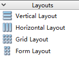
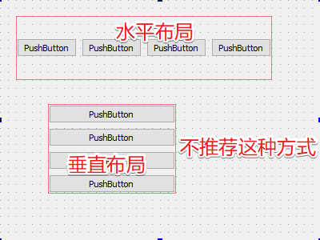
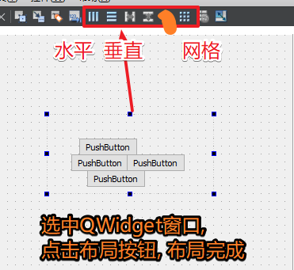
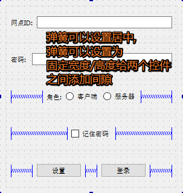
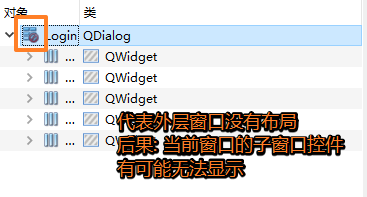
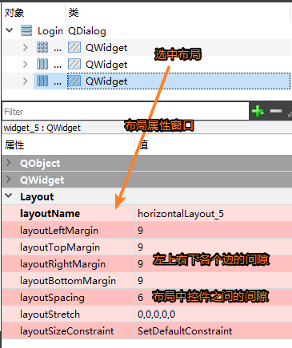

# 1. 布局

> 为什么要布局:
>
> 1. 布局之后窗口的排列是有序的
> 2. 布局之后窗口的大小发生变化, 控件的大小也会对应变化
> 3. 如果不对控件布局, 窗口显示出来之后有些控件的看不到的
>
> 布局是可以嵌套使用

常用的布局方式:

- 水平布局 -> 所有的控件水平排列 -> 一行多列
- 垂直布局 -> 所有控件垂直排列   -> 多行一列
- 网格(栅格)布局 -> 多行多列

在Qt中设置布局的两种方式

- 使用Qt提供的布局

  

  

  

- `使用QWidget进行布局 -> 推荐`

  > 1. 首先需要从工具栏中拖拽一个QWidget窗口
  >
  > 2. 将要布局的控件放到这个QWidget中
  > 3. 对这个QWidget进行布局

  

  - 这种方式可以通过布局按钮, 对当前布局进行直接的切换, 方便修改

  - 关于弹簧的使用

    

  - 布局的注意事项

    

  - 布局属性设置

    