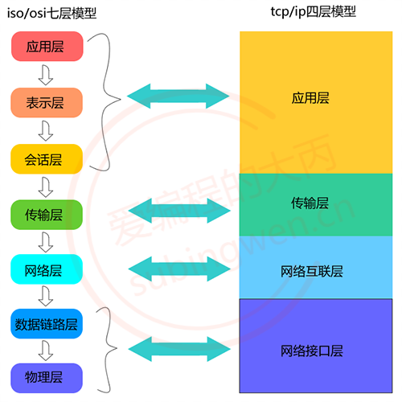
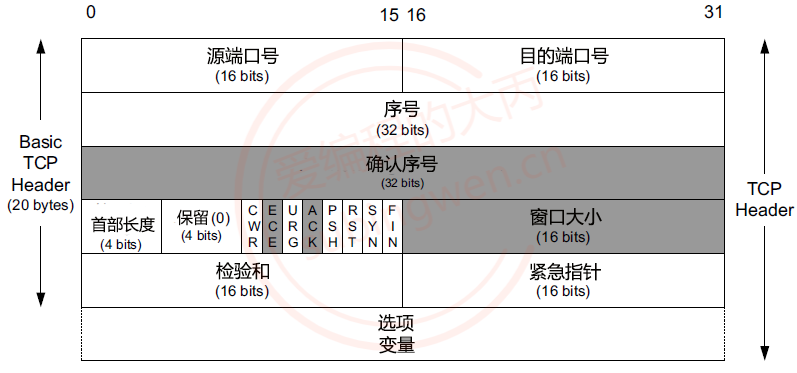
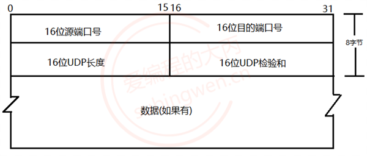
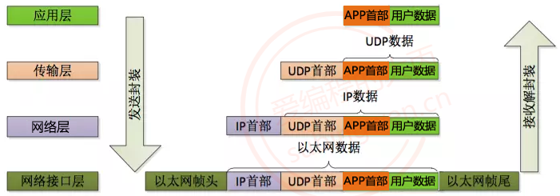
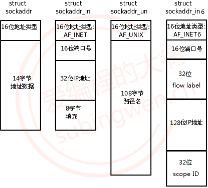

# 网络知识汇总

## 1、概念

### 1.1 局域网和广域网

局域网：局域网将一定区域内的各种计算机、外部设备和数据库连接起来形成计算机通信的私有网络。

广域网：又称广域网、外网、公网。是连接不同地区局域网或城域网计算机通信的远程公共网络。

### 1.2 IP

IP（Internet Protocol）：本质是一个整形数，用于表示计算机在网络中的地址。IP 协议版本有两个：IPv4 和 IPv6。

Ipv4：  

-  使用一个 32 位的整形数描述一个 IP 地址，4 个字节，int 型；

- 也可以使用一个点分十进制字符串描述这个 IP 地址： 192.168.247.135；

-  分成了 4 份，每份 1 字节，8bit（char），最大值为 255；

​         0.0.0.0 是最小的 IP 地址

​	55.255.255.255 是最大的 IP 地址；

-  按照 IPv4 协议计算，可以使用的 IP 地址共有 2的32次方 个；

IPv6：

- 使用一个 128 位的整形数描述一个 IP 地址，16 个字节
- 也可以使用一个字符串来描述这个ip：2001:0db8:3c4d:0015:0000:0000:1a2f:1a2b；
- 分成了 8 份，每份 2 字节，每一部分以 16 进制的方式表示
- 按照 IPv6 协议计算，可以使用的 IP 地址共有 2的128次方个；

```
# linux
$ ifconfig

# windows
$ ipconfig

# 测试网络是否畅通
# 主机a: 192.168.1.11
# 当前主机: 192.168.1.12
$ ping 192.168.1.11     # 测试是否可用连接局域网
$ ping www.baidu.com    # 测试是否可用连接外网

# 特殊的IP地址: 127.0.0.1  ==> 和本地的IP地址是等价的
# 假设当前电脑没有联网, 就没有IP地址, 又要做网络测试, 可用使用 127.0.0.1 进行本地测试
```

### 1.3 端口

端口的作用是定位到主机上的某一个进程，通过这个端口进程就可以接受到对应的网络数据了。

端口也是一个整形数 unsigned short ，一个 16 位整形数，有效端口的取值范围是：0 ~ 65535(0 ~ 216-1)

提问：计算机中所有的进程都需要关联一个端口吗，一个端口可以被重复使用吗？

- 不需要，如果这个进程不需要网络通信，那么这个进程就不需要绑定端口。


- 一个端口只能给某一个进程使用，多个进程不能同时使用同一个端口。

### 1.4 OSI/ISO 网络分层模型

OSI（Open System Interconnect），即开放式系统互联。 一般都叫 OSI 参考模型，是 ISO（国际标准化组织组织）在 1985 年研究的网络互联模型。



- **物理层：**

  ​	负责最后将信息编码成电流脉冲或其它信号用于网上传输

- **数据链路层:**

  ​	数据链路层通过物理网络链路供数据传输。

  ​	规定了 0 和 1 的分包形式，确定了网络数据包的形式；

- **网络层**

  ​	网络层负责在源和终点之间建立连接；

  ​	此处需要确定计算机的位置，通过 IPv4，IPv6 格式的 IP 地址来找到对应的主机

- **传输层**

  ​	传输层向高层提供可靠的端到端的网络数据流服务。

  ​	每一个应用程序都会在网卡注册一个端口号，该层就是端口与端口的通信

- **会话层**

  ​	会话层建立、管理和终止表示层与实体之间的通信会话；

  ​	建立一个连接（自动的手机信息、自动的网络寻址）;

- **表示层:**

  ​	对应用层数据编码和转化，确保以一个系统应用层发送的信息 可以被另一个系统应用层识别；

## 2. 网络协议

网络协议指的是计算机网络中互相通信的对等实体之间交换信息时所必须遵守的规则的集合。一般系统网络协议包括五个部分：通信环境，传输服务，词汇表，信息的编码格式，时序、规则和过程。先来通过下面几幅图了解一下常用的网络协议的格式：

### 2.1 TCP 协议 -> 传输层协议



### 2.2 UDP 协议 -> 传输层协议



### 2.3 IP 协议 -> 网络层协议


### 2.4 以太网帧协议 -> 网络接口层协议


### 2.5 数据的封装




在网络通信的时候，程序猿需要负责的应用层数据的处理 (最上层)

应用层的数据可以使用某些协议进行封装，也可以不封装

程序猿需要调用发送数据的接口函数，将数据发送出去

程序猿调用的 API 做底层数据处理

- 传输层使用传输层协议打包数据

- 网络层使用网络层协议打包数据
- 网络接口层使用网络接口层协议打包数据

- 数据被发送到 internet

接收端接收到发送端的数据

​	程序猿调用接收数据的函数接收数据
​	调用的 API 做相关的底层处理:
​		网络接口层拆包 ==> 网络层的包
​		网络层拆包 ==> 网络层的包
​		传输层拆包 ==> 传输层数据
​	如果应用层也使用了协议对数据进行了封装，数据的包的解析需要程序猿做

## 3.socket 编程

套接字对应程序猿来说就是一套网络通信的接口，使用这套接口就可以完成网络通信。网络通信的主体主要分为两部分：客户端和服务器端。在客户端和服务器通信的时候需要频繁提到三个概念：IP、端口、通信数据，下面介绍一下需要注意的一些细节问题。

### 3.1 字节序

在各种计算机体系结构中，对于字节、字等的存储机制有所不同，因而引发了计算机通信领域中一个很重要的问题，即通信双方交流的信息单元（比特、字节、字、双字等等）应该以什么样的顺序进行传送。如果不达成一致的规则，通信双方将无法进行正确的编 / 译码从而导致通信失败。

- Little-Endian -> 主机字节序 (小端)


数据的低位字节存储到内存的低地址位 , 数据的高位字节存储到内存的高地址位

我们使用的 PC 机，数据的存储默认使用的是小端

- Big-Endian -> 网络字节序 (大端)

据的低位字节存储到内存的高地址位 , 数据的高位字节存储到内存的低地址位
套接字通信过程中操作的数据都是大端存储的，包括：接收/发送的数据、IP地址、端口。

```
// 有一个16进制的数, 有32位 (int): 0xab5c01ff
// 字节序, 最小的单位: char 字节, int 有4个字节, 需要将其拆分为4份
// 一个字节 unsigned char, 最大值是 255(十进制) ==> ff(16进制) 
                 内存低地址位                内存的高地址位
--------------------------------------------------------------------------->
小端:         0xff        0x01        0x5c        0xab
大端:         0xab        0x5c        0x01        0xff
```

- 函数

BSD Socket 提供了封装好的转换接口，方便程序员使用。包括从主机字节序到网络字节序的转换函数：htons、htonl；从网络字节序到主机字节序的转换函数：ntohs、ntohl。

```
#include <arpa/inet.h>
// u:unsigned
// 16: 16位, 32:32位
// h: host, 主机字节序
// n: net, 网络字节序
// s: short
// l: int

// 这套api主要用于 网络通信过程中 IP 和 端口 的 转换
// 将一个短整形从主机字节序 -> 网络字节序
uint16_t htons(uint16_t hostshort);	
// 将一个整形从主机字节序 -> 网络字节序
uint32_t htonl(uint32_t hostlong);	

// 将一个短整形从网络字节序 -> 主机字节序
uint16_t ntohs(uint16_t netshort)
// 将一个整形从网络字节序 -> 主机字节序
uint32_t ntohl(uint32_t netlong);
```

### 3.2  IP 地址转换

虽然 IP 地址本质是一个整形数，但是在使用的过程中都是通过一个字符串来描述，下面的函数描述了如何将一个字符串类型的 IP 地址进行大小端转换：

```
// 主机字节序的IP地址转换为网络字节序
// 主机字节序的IP地址是字符串, 网络字节序IP地址是整形
int inet_pton(int af, const char *src, void *dst); 
```

参数:

- **af**: 地址族 (IP 地址的家族包括 ipv4 和 ipv6) 协议
  - AF_INET: ipv4 格式的 ip 地址
  - AF_INET6: ipv6 格式的 ip 地址
- **src**: 传入参数，对应要转换的点分十进制的 ip 地址: 192.168.1.100
- **dst**: 传出参数，函数调用完成，转换得到的大端整形 IP 被写入到这块内存中
- **返回**值：成功返回 1，失败返回 0 或者 - 1

```
#include <arpa/inet.h>
// 将大端的整形数, 转换为小端的点分十进制的IP地址        
const char *inet_ntop(int af, const void *src, char *dst, socklen_t size);
```

参数:

- **af**: 地址族协议

  - AF_INET: ipv4 格式的 ip 地址
  - AF_INET6: ipv6 格式的 ip 地址

- **src**: 传入参数，这个指针指向的内存中存储了大端的整形 IP 地址

- **dst**: 传出参数，存储转换得到的小端的点分十进制的 IP 地址

- **size**: 修饰 dst 参数的，标记 dst 指向的内存中最多可以存储多少个字节

- **返回值**:

  成功：指针指向第三个参数对应的内存地址，通过返回值也可以直接取出转换得到的 IP 字符串
  失败: NULL

**还有一组函数也能进程 IP 地址大小端的转换，但是只能处理 ipv4 的 ip 地址：**

```
// 点分十进制IP -> 大端整形
in_addr_t inet_addr (const char *cp);

// 大端整形 -> 点分十进制IP
char* inet_ntoa(struct in_addr in);
```

### 3.3 sockaddr 数据结构

​	

```
// 在写数据的时候不好用
struct sockaddr {
	sa_family_t sa_family;       // 地址族协议, ipv4
	char        sa_data[14];     // 端口(2字节) + IP地址(4字节) + 填充(8字节)
}

typedef unsigned short  uint16_t;
typedef unsigned int    uint32_t;
typedef uint16_t in_port_t;
typedef uint32_t in_addr_t;
typedef unsigned short int sa_family_t;
#define __SOCKADDR_COMMON_SIZE (sizeof (unsigned short int))

struct in_addr
{
    in_addr_t s_addr;
};  

// sizeof(struct sockaddr) == sizeof(struct sockaddr_in)
struct sockaddr_in
{
    sa_family_t sin_family;		/* 地址族协议: AF_INET */
    in_port_t sin_port;         /* 端口, 2字节-> 大端  */
    struct in_addr sin_addr;    /* IP地址, 4字节 -> 大端  */
    /* 填充 8字节 */
    unsigned char sin_zero[sizeof (struct sockaddr) - sizeof(sin_family) -
               sizeof (in_port_t) - sizeof (struct in_addr)];
};  
```

### 3.4 套接字函数

```
// 创建一个套接字
int socket(int domain, int type, int protocol);
```

参数：

**domain** 使用的地址族协议

- AF_INET: 使用 IPv4 格式的 ip 地址
- AF_INET6: 使用 IPv4 格式的 ip 地址

**type**:

- SOCK_STREAM: 使用流式的传输协议

- SOCK_DGRAM: 使用报式 (报文) 的传输协议

**protocol**: 一般写 0 即可，使用默认的协议

- SOCK_STREAM: 流式传输默认使用的是 tcp

- SOCK_DGRAM: 报式传输默认使用的 udp

**返回值**:

​	成功：可用于套接字通信的文件描述符

​	失败: -1

**函数的返回值是一个文件描述符，通过这个文件描述符可以操作内核中的某一块内存，网络通信是基于这个文件描述符来完成的。**

```
// 将文件描述符和本地的IP与端口进行绑定   
int bind(int sockfd, const struct sockaddr *addr, socklen_t addrlen);
```

参数:
**sockfd**: 监听的文件描述符，通过 socket () 调用得到的返回值
**addr**: 传入参数，要绑定的 IP 和端口信息需要初始化到这个结构体中，IP和端口要转换为网络字节序
**addrlen**: 参数 addr 指向的内存大小，sizeof (struct sockaddr)
**返回值**：成功返回 0，失败返回 - 1

```
// 给监听的套接字设置监听
int listen(int sockfd, int backlog);
```

参数:
**sockfd**: 文件描述符，可以通过调用 socket () 得到，在监听之前必须要绑定 bind ()
**backlog**: 同时能处理的最大连接要求，最大值为 128
**返回值**：函数调用成功返回 0，调用失败返回 -1

```
// 等待并接受客户端的连接请求, 建立新的连接, 会得到一个新的文件描述符(通信的)		
int accept(int sockfd, struct sockaddr *addr, socklen_t *addrlen);
```

参数:
**sockfd**: 监听的文件描述符
**addr**: 传出参数，里边存储了建立连接的客户端的地址信息
**addrlen**: 传入传出参数，用于存储 addr 指向的内存大小
**返回值**：函数调用成功，得到一个文件描述符，用于和建立连接的这个客户端通信，调用失败返回 -1

**这个函数是一个阻塞函数，当没有新的客户端连接请求的时候，该函数阻塞；当检测到有新的客户端连接请求时，阻塞解除，新连接就建立了，得到的返回值也是一个文件描述符，基于这个文件描述符就可以和客户端通信了。**

```
// 接收数据
ssize_t read(int sockfd, void *buf, size_t size);
ssize_t recv(int sockfd, void *buf, size_t size, int flags);
```

参数:
**sockfd**: 用于通信的文件描述符，accept () 函数的返回值
**buf**: 指向一块有效内存，用于存储接收是数据
**size**: 参数 buf 指向的内存的容量
**flags**: 特殊的属性，一般不使用，指定为 0
**返回值**:
​	大于 0：实际接收的字节数
​	等于 0：对方断开了连接
​	-1：接收数据失败了

**如果连接没有断开，接收端接收不到数据，接收数据的函数会阻塞等待数据到达，数据到达后函数解除阻塞，开始接收数据，当发送端断开连接，接收端无法接收到任何数据，但是这时候就不会阻塞了，函数直接返回0。**

```
// 发送数据的函数
ssize_t write(int fd, const void *buf, size_t len);
ssize_t send(int fd, const void *buf, size_t len, int flags);
```

参数:
**fd**: 通信的文件描述符，accept () 函数的返回值
**buf**: 传入参数，要发送的字符串
**len**: 要发送的字符串的长度
**flags**: 特殊的属性，一般不使用，指定为 0
**返回值**：
​	大于 0：实际发送的字节数，和参数 len 是相等的
​	-1：发送数据失败了

```
// 成功连接服务器之后, 客户端会自动随机绑定一个端口
// 服务器端调用accept()的函数, 第二个参数存储的就是客户端的IP和端口信息
int connect(int sockfd, const struct sockaddr *addr, socklen_t addrlen);
```

参数:
**sockfd**: 通信的文件描述符，通过调用 socket () 函数就得到了
**addr**: 存储了要连接的服务器端的地址信息: iP 和 端口，这个 IP 和端口也需要转换为大端然后再赋值
**addrlen**: addr 指针指向的内存的大小 sizeof (struct sockaddr)
**返回值**：连接成功返回 0，连接失败返回 - 1


## 4. TCP 通信流程

TCP 是一个面向连接的，安全的，流式传输协议，这个协议是一个传输层协议。

- **面向连接**：是一个双向连接，通过三次握手完成，断开连接需要通过四次挥手完成。
- **安全**：tcp 通信过程中，会对发送的每一数据包都会进行校验，如果发现数据丢失，会自动重传
- **流式传输**：发送端和接收端处理数据的速度，数据的量都可以不一致。


### 4.1 服务器端通信流程

- **创建用于监听的套接字，这个套接字是一个文件描述符**

```
int lfd = socket();
```

- **将得到的监听的文件描述符和本地的 IP 端口进行绑定**

```
bind();
```

- **设置监听 (成功之后开始监听，监听的是客户端的连接)**

```
listen();
```

- **等待并接受客户端的连接请求，建立新的连接，会得到一个新的文件描述符 (通信的)，没有新连接请求就阻塞**

```
int cfd = accept();
```

- **通信，读写操作默认都是阻塞的**

```
// 接收数据
read(); / recv();
// 发送数据
write(); / send();
```

- **断开连接，关闭套接字**

```
close();
```

**在 tcp 的服务器端，有两类文件描述符**

- **监听的文件描述符**

   只需要有一个

​	不负责和客户端通信，负责检测客户端的连接请求，检测到之后调用 accept 就可以建立新的连接

- **通信的文件描述符**

​	负责和建立连接的客户端通信

​	如果有 N 个客户端和服务器建立了新的连接，通信的文件描述符就有 N 个，每个客户端和服务器都对应一个通信的文件描述符.


- **文件描述符对应的内存结构**：
  - 一个文件文件描述符对应两块内存, 一块内存是读缓冲区, 一块内存是写缓冲区
  - 读数据: 通过文件描述符将内存中的数据读出, 这块内存称之为读缓冲区
  - 写数据: 通过文件描述符将数据写入到某块内存中, 这块内存称之为写缓冲区

- **监听的文件描述符**:

  - 客户端的连接请求会发送到服务器端监听的文件描述符的读缓冲区中
  - 读缓冲区中有数据，说明有新的客户端连接
  - 调用 accept () 函数，这个函数会检测监听文件描述符的读缓冲区

  ​	检测不到数据，该函数阻塞
  ​	如果检测到数据，解除阻塞，新的连接建立

- **通信的文件描述符:**

  - 客户端和服务器端都有通信的文件描述符
  - 发送数据：调用函数 write () /send ()，数据进入到内核中

  ​	数据并没有被发送出去，而是将数据写入到了通信的文件描述符对应的写缓冲区中

  ​	内核检测到通信的文件描述符写缓冲区中有数据，内核会将数据发送到网络中

  - 接收数据：调用的函数 read () /recv (), 从内核读数据

  ​	数据如何进入到内核程序猿不需要处理，数据进入到通信的文件描述符的读缓冲区中
  ​	数据进入到内核，必须使用通信的文件描述符，将数据从读缓冲区中读出即可

**基于 tcp 的服务器端通信代码:**

```
// server.c
#include <stdio.h>
#include <stdlib.h>
#include <unistd.h>
#include <string.h>
#include <arpa/inet.h>

int main()
{
    // 1. 创建监听的套接字
    int lfd = socket(AF_INET, SOCK_STREAM, 0);
    if(lfd == -1)
    {
        perror("socket");
        exit(0);
    }

    // 2. 将socket()返回值和本地的IP端口绑定到一起
    struct sockaddr_in addr;
    addr.sin_family = AF_INET;
    addr.sin_port = htons(10000);   // 大端端口
    // INADDR_ANY代表本机的所有IP, 假设有三个网卡就有三个IP地址
    // 这个宏可以代表任意一个IP地址
    // 这个宏一般用于本地的绑定操作
    addr.sin_addr.s_addr = INADDR_ANY;  // 这个宏的值为0 == 0.0.0.0
//    inet_pton(AF_INET, "192.168.237.131", &addr.sin_addr.s_addr);
    int ret = bind(lfd, (struct sockaddr*)&addr, sizeof(addr));
    if(ret == -1)
    {
        perror("bind");
        exit(0);
    }

    // 3. 设置监听
    ret = listen(lfd, 128);
    if(ret == -1)
    {
        perror("listen");
        exit(0);
    }

    // 4. 阻塞等待并接受客户端连接
    struct sockaddr_in cliaddr;
    int clilen = sizeof(cliaddr);
    int cfd = accept(lfd, (struct sockaddr*)&cliaddr, &clilen);
    if(cfd == -1)
    {
        perror("accept");
        exit(0);
    }
    // 打印客户端的地址信息
    char ip[24] = {0};
    printf("客户端的IP地址: %s, 端口: %d\n",
           inet_ntop(AF_INET, &cliaddr.sin_addr.s_addr, ip, sizeof(ip)),
           ntohs(cliaddr.sin_port));

    // 5. 和客户端通信
    while(1)
    {
        // 接收数据
        char buf[1024];
        memset(buf, 0, sizeof(buf));
        int len = read(cfd, buf, sizeof(buf));
        if(len > 0)
        {
            printf("客户端say: %s\n", buf);
            write(cfd, buf, len);
        }
        else if(len  == 0)
        {
            printf("客户端断开了连接...\n");
            break;
        }
        else
        {
            perror("read");
            break;
        }
    }

    close(cfd);
    close(lfd);

    return 0;
}
```


### 4.2 客户端的通信流程

- **创建一个通信的套接字**

```
int cfd = socket();
```


- **连接服务器，需要知道服务器绑定的 IP 和端口**

```
connect();
```


- **通信**

```
// 接收数据
read(); / recv();
// 发送数据
write(); / send();
```


- **断开连接，关闭文件描述符 (套接字)**

```
close();
```


**基于 tcp 通信的客户端通信代码:**

```
// client.c
#include <stdio.h>
#include <stdlib.h>
#include <unistd.h>
#include <string.h>
#include <arpa/inet.h>

int main()
{
    // 1. 创建通信的套接字
    int fd = socket(AF_INET, SOCK_STREAM, 0);
    if(fd == -1)
    {
        perror("socket");
        exit(0);
    }

    // 2. 连接服务器
    struct sockaddr_in addr;
    addr.sin_family = AF_INET;
    addr.sin_port = htons(10000);   // 大端端口
    inet_pton(AF_INET, "192.168.237.131", &addr.sin_addr.s_addr);

    int ret = connect(fd, (struct sockaddr*)&addr, sizeof(addr));
    if(ret == -1)
    {
        perror("connect");
        exit(0);
    }

    // 3. 和服务器端通信
    int number = 0;
    while(1)
    {
        // 发送数据
        char buf[1024];
        sprintf(buf, "你好, 服务器...%d\n", number++);
        write(fd, buf, strlen(buf)+1);
        
        // 接收数据
        memset(buf, 0, sizeof(buf));
        int len = read(fd, buf, sizeof(buf));
        if(len > 0)
        {
            printf("服务器say: %s\n", buf);
        }
        else if(len  == 0)
        {
            printf("服务器断开了连接...\n");
            break;
        }
        else
        {
            perror("read");
            break;
        }
        sleep(1);   // 每隔1s发送一条数据
    }

    close(fd);

    return 0;
}

```

